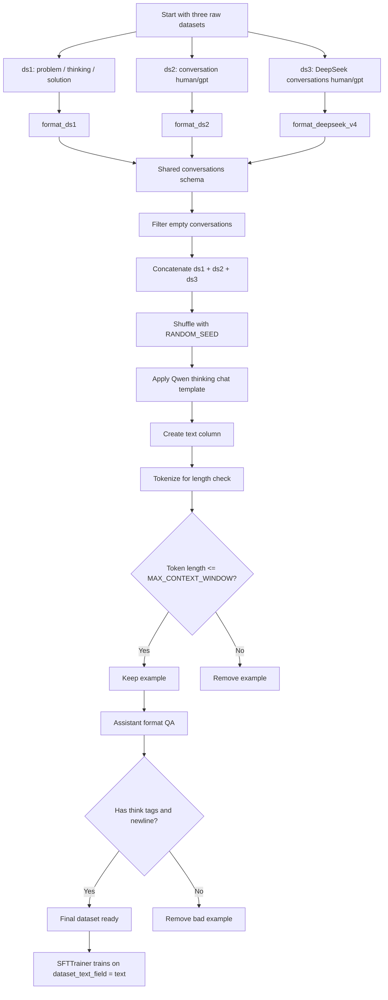
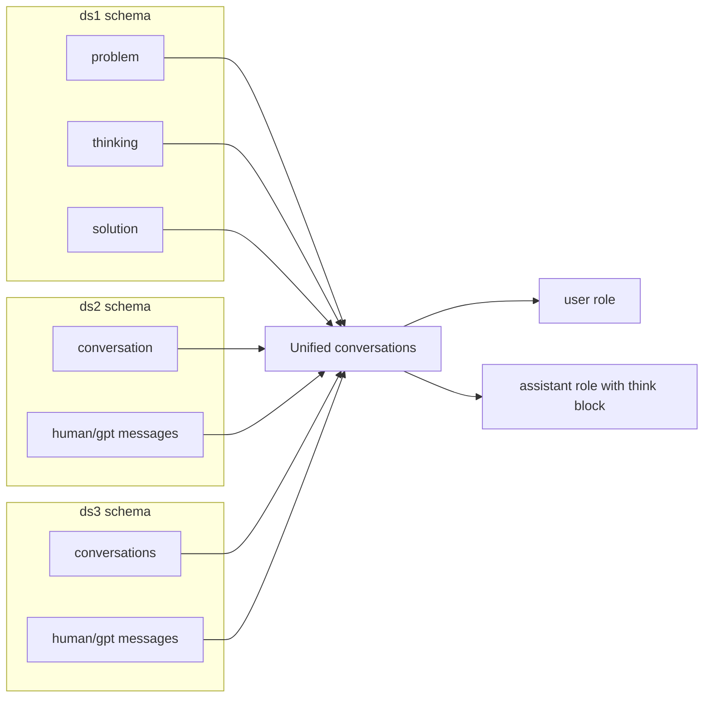
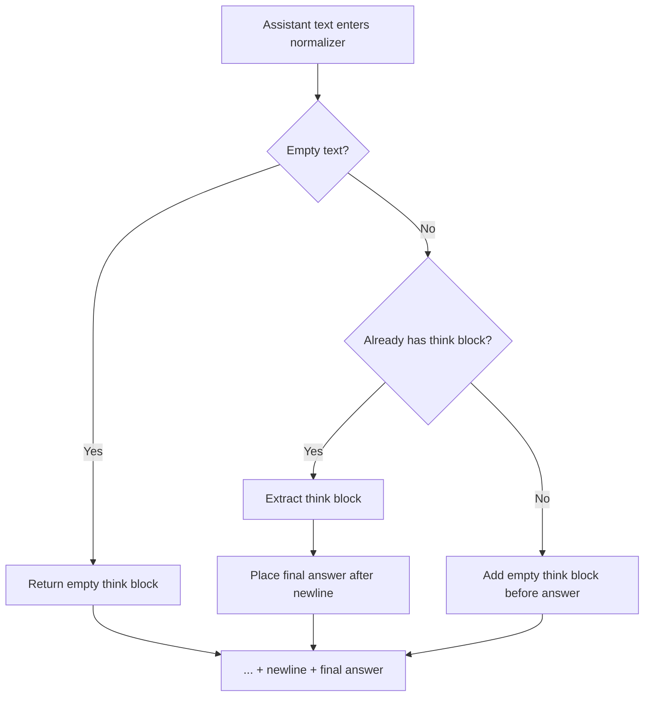
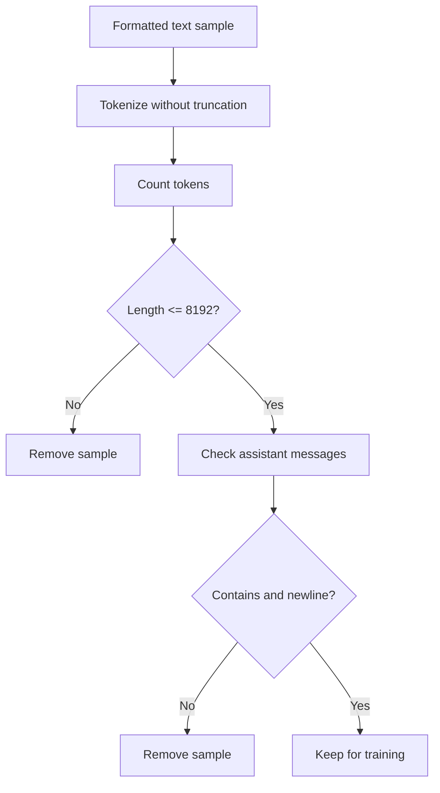

# Dataset Processing Pipeline Explained

This note explains the full dataset-processing section used in the Qwen3.5 LoRA/QLoRA fine-tuning notebook.

This section happens **before training**. Its job is to take multiple datasets with different schemas, normalize them into one consistent conversation format, serialize them through the Qwen chat template, remove overly long examples, and verify the assistant response format before `SFTTrainer` sees the data.

---

## 1. What this section does overall

At a high level, this code does this:

```text
Load ds1 + ds2 + ds3
→ normalize each dataset into a shared conversations format
→ concatenate the datasets
→ apply the Qwen thinking chat template
→ create a final text column for SFTTrainer
→ filter examples longer than MAX_CONTEXT_WINDOW
→ verify assistant messages include <think>...</think>
→ print a sample for human sanity-checking
```

The final output is a Hugging Face `Dataset` object called:

```python
dataset
```

with a key column:

```python
"text"
```

That `text` column is what the trainer later uses here:

```python
dataset_text_field = "text"
```

---

## 2. Imports

```python
from datasets import load_dataset, concatenate_datasets, Dataset
from unsloth.chat_templates import get_chat_template
import re
import json
import multiprocessing as mp
import pandas as pd
```

### `load_dataset`

Loads datasets from Hugging Face Datasets.

Example:

```python
load_dataset("Jackrong/DeepSeek-V4-Distill-8000x", split="train")
```

### `concatenate_datasets`

Combines multiple Hugging Face datasets into one dataset.

In this notebook:

```python
combined_dataset = concatenate_datasets([ds1, ds2, ds3])
```

### `Dataset`

Hugging Face Dataset class. In the current DeepSeek replacement version, you may not need this import directly, but it is harmless.

### `get_chat_template`

Comes from Unsloth. It modifies/configures the tokenizer so it knows how to format messages using the chosen model’s chat template.

Here we use:

```python
chat_template="qwen3-thinking"
```

### `re`

Used for regular expressions, especially checking and normalizing `<think>...</think>` blocks.

### `json`

Used by `parse_message_item`. This is useful if a dataset stores messages as JSON strings instead of Python dictionaries.

### `multiprocessing as mp`

Used to get CPU core count:

```python
num_proc = mp.cpu_count()
```

Then the dataset filtering/mapping can use multiple CPU processes.

### `pandas as pd`

This was more important in the original Roman ds3 fallback version. With the DeepSeek replacement, it may not be used, but keeping it does not break anything.

---

## 3. Global configuration

```python
RANDOM_SEED = 12181531
MAX_CONTEXT_WINDOW = 8192
```

### `RANDOM_SEED`

This makes shuffling deterministic. If you rerun with the same seed and same dataset state, you should get the same sample ordering.

Used here:

```python
ds.shuffle(seed=RANDOM_SEED)
```

and here:

```python
combined_dataset.shuffle(seed=RANDOM_SEED)
```

### `MAX_CONTEXT_WINDOW`

This controls the maximum token length allowed for a training example.

```python
MAX_CONTEXT_WINDOW = 8192
```

Later, any serialized training example with more than 8192 tokens gets removed.

Important: this should usually match your model loading context:

```python
max_seq_length = 8192
```

So the clean pairing is:

```python
max_seq_length = 8192
MAX_CONTEXT_WINDOW = 8192
```

---

## 4. Dataset sample counts

```python
num_samples_dict = {
    "ds1": 3000,
    "ds2": 700,
    "ds3": 5000,
}
```

This decides how many examples to request from each dataset.

In this official run plan:

```text
ds1 = 3000 examples from nohurry/Opus-4.6-Reasoning-3000x-filtered
ds2 = 700 examples from Jackrong/Qwen3.5-reasoning-700x
ds3 = 5000 examples from Jackrong/DeepSeek-V4-Distill-8000x
```

The total requested dataset size before filtering is:

```text
3000 + 700 + 5000 = 8700 examples
```

This is not necessarily the final dataset size. Some examples may be removed during:

```text
schema normalization
empty conversation filtering
length filtering
assistant format QA
```

---

## 5. Applying the Qwen thinking chat template

```python
tokenizer = get_chat_template(
    tokenizer,
    chat_template="qwen3-thinking",
)
```

This prepares the tokenizer to serialize chat messages using the Qwen thinking format.

Your normalized examples look like this before serialization:

```python
[
    {"role": "user", "content": "..."},
    {"role": "assistant", "content": "<think>...</think>\nfinal answer"},
]
```

Later, `tokenizer.apply_chat_template(...)` turns that list into one training string with Qwen role markers.

Conceptually, the text becomes something like:

```text
<|im_start|>user
...
<|im_end|>
<|im_start|>assistant
<think>...</think>
final answer
<|im_end|>
```

This matters because the model was trained to expect its native chat format. If the template is wrong, the model may learn unstable formatting or weaker instruction-following behavior.

---

## 6. Dataset loading helper

```python
def load_and_sample(dataset_name, sample_count=None, split="train", subset=None):
    if subset:
        ds = load_dataset(dataset_name, subset, split=split)
    else:
        ds = load_dataset(dataset_name, split=split)

    if sample_count is not None:
        sample_count = min(sample_count, len(ds))
        ds = ds.shuffle(seed=RANDOM_SEED).select(range(sample_count))

    return ds
```

This function does two jobs:

```text
1. Load a Hugging Face dataset.
2. Shuffle and select a limited number of samples.
```

### `dataset_name`

The Hugging Face dataset ID.

Example:

```python
"Jackrong/DeepSeek-V4-Distill-8000x"
```

### `sample_count`

How many rows you want to use.

If the dataset has fewer rows than requested, this line prevents an error:

```python
sample_count = min(sample_count, len(ds))
```

So if you request 3000 but the dataset only has 2900 rows, it just uses 2900.

### `split`

Usually:

```python
split="train"
```

### `subset`

Some Hugging Face datasets have subsets/configs. This code supports that, although your current datasets do not need it.

### Why shuffle before selecting?

This is important:

```python
ds.shuffle(seed=RANDOM_SEED).select(range(sample_count))
```

Without shuffling, selecting the first N rows could accidentally bias the dataset if examples are sorted by topic, difficulty, or source.

---

## 7. Loading the three datasets

### ds1

```python
ds1 = load_and_sample(
    "nohurry/Opus-4.6-Reasoning-3000x-filtered",
    num_samples_dict["ds1"],
    split="train",
)
```

This dataset uses a schema like:

```text
problem / thinking / solution
```

So it needs a custom formatter that turns those fields into:

```python
[
    {"role": "user", "content": problem},
    {"role": "assistant", "content": "<think>thinking</think>\nsolution"},
]
```

### ds2

```python
ds2 = load_and_sample(
    "Jackrong/Qwen3.5-reasoning-700x",
    num_samples_dict["ds2"],
    split="train",
)
```

This dataset uses a multi-turn conversation schema with messages like:

```python
{"from": "human", "value": "..."}
{"from": "gpt", "value": "..."}
```

The formatter converts:

```text
human → user
gpt → assistant
```

### ds3

```python
ds3 = load_and_sample(
    "Jackrong/DeepSeek-V4-Distill-8000x",
    num_samples_dict["ds3"],
    split="train"
)
```

This is your replacement dataset.

It uses a `conversations` field with:

```python
{"from": "human", "value": "..."}
{"from": "gpt", "value": "<think>...</think>\nanswer"}
```

So it is very easy to normalize into the same final format.

---

## 8. Safe string cleanup helper

```python
def _strip(x):
    return (x or "").strip()
```

This safely strips whitespace from a string.

If `x` is `None`, this avoids an error:

```python
None.strip()
```

Instead:

```python
(x or "").strip()
```

turns `None` into an empty string.

Examples:

```python
_strip(" hello ")  # "hello"
_strip(None)       # ""
_strip("")         # ""
```

---

## 9. Think-block regex

```python
THINK_BLOCK_RE = re.compile(r"<think>.*?</think>", flags=re.DOTALL)
```

This creates a regex pattern that finds a `<think>...</think>` block.

### Why `.*?`?

`.*?` means match as little as possible while still finding the closing `</think>`.

### Why `re.DOTALL`?

Reasoning blocks often span multiple lines:

```text
<think>
Line 1
Line 2
</think>
```

Without `re.DOTALL`, the `.` would not match newlines correctly.

---

## 10. Normalizing assistant answers into think-solution format

```python
def normalize_assistant_to_think_solution(text: str) -> str:
    text = _strip(text)

    if not text:
        return "<think></think>\n"

    m = THINK_BLOCK_RE.search(text)
    if m:
        think_block = m.group(0).strip()
        rest = text[m.end():].lstrip()
        return f"{think_block}\n{rest}".rstrip() if rest else f"{think_block}\n"

    return f"<think></think>\n{text}".rstrip()
```

This function makes sure every assistant answer follows the same format:

```text
<think>...</think>
final answer
```

### Case 1: empty assistant text

```python
if not text:
    return "<think></think>\n"
```

If there is no answer content, it still returns a valid empty think block.

### Case 2: answer already has think tags

```python
m = THINK_BLOCK_RE.search(text)
```

If a `<think>...</think>` block exists, it extracts it:

```python
think_block = m.group(0).strip()
```

Then it takes everything after the think block as the final answer:

```python
rest = text[m.end():].lstrip()
```

It returns:

```text
<think>...</think>
final answer
```

This removes weird extra spacing and standardizes the newline.

### Case 3: answer has no think tags

```python
return f"<think></think>\n{text}".rstrip()
```

If the answer is plain text, it wraps it with an empty think block.

This keeps the format consistent for all assistant messages.

---

## 11. Building assistant answer from separate reasoning and content fields

```python
def build_assistant_with_reasoning(content: str, reasoning: str = "") -> str:
    content = _strip(content)
    reasoning = _strip(reasoning)

    if "<think>" in content and "</think>" in content:
        return normalize_assistant_to_think_solution(content)

    if reasoning:
        if content:
            return f"<think>{reasoning}</think>\n{content}"
        return f"<think>{reasoning}</think>\n"

    return normalize_assistant_to_think_solution(content)
```

This helper is useful when a dataset separates:

```text
reasoning field
final answer/content field
```

It combines them into:

```text
<think>reasoning</think>
final answer
```

### Case 1: content already has think tags

```python
if "<think>" in content and "</think>" in content:
    return normalize_assistant_to_think_solution(content)
```

No need to add another think block.

### Case 2: separate reasoning exists

```python
if reasoning:
    if content:
        return f"<think>{reasoning}</think>\n{content}"
    return f"<think>{reasoning}</think>\n"
```

This is the ideal case for datasets that have explicit reasoning.

### Case 3: no reasoning exists

```python
return normalize_assistant_to_think_solution(content)
```

Falls back to empty think block if needed.

---

## 12. Parsing mixed message items

```python
def parse_message_item(m):
    if isinstance(m, dict):
        return m

    if isinstance(m, str):
        s = m.strip()
        if not s:
            return None
        try:
            obj = json.loads(s)
            return obj if isinstance(obj, dict) else None
        except Exception:
            return None

    return None
```

This function handles datasets where messages might be stored either as:

```text
Python dictionaries
JSON strings
invalid/empty values
```

It returns:

```text
dict if valid
None if invalid
```

In your current DeepSeek ds3 replacement, this is less important, but it is still useful for robust dataset code.

---

## 13. Formatting ds1

```python
def format_ds1(examples):
    problems = examples.get("problem", [])
    thinkings = examples.get("thinking", [])
    solutions = examples.get("solution", [])

    out = []
    for p, t, s in zip(problems, thinkings, solutions):
        p = _strip(p)
        t = _strip(t)
        s = _strip(s)

        if not p or not s:
            continue

        assistant = f"<think>{t}</think>\n{s}" if t else f"<think></think>\n{s}"

        out.append([
            {"role": "user", "content": p},
            {"role": "assistant", "content": assistant},
        ])

    return {"conversations": out}
```

This converts ds1 from:

```text
problem / thinking / solution
```

into the shared conversation format:

```python
[
    {"role": "user", "content": problem},
    {"role": "assistant", "content": "<think>thinking</think>\nsolution"},
]
```

### Why skip if no problem or no solution?

```python
if not p or not s:
    continue
```

A training sample without a user prompt or assistant answer is not useful.

### Why allow empty thinking?

If `thinking` is missing, it still creates:

```text
<think></think>
solution
```

This keeps the assistant format consistent.

---

## 14. Formatting ds2

```python
def format_ds2(examples):
    convos_list = examples.get("conversation", [])
    out = []

    for conv in convos_list:
        if not conv:
            continue

        cleaned = []
        for m in conv:
            frm = (m.get("from") or "").strip()
            val = m.get("value", "")

            if frm == "human":
                cleaned.append({"role": "user", "content": _strip(val)})
            elif frm == "gpt":
                cleaned.append({
                    "role": "assistant",
                    "content": normalize_assistant_to_think_solution(val),
                })

        if len(cleaned) < 2 or cleaned[-1]["role"] != "assistant":
            continue

        out.append(cleaned)

    return {"conversations": out}
```

This converts a conversation dataset from:

```python
{"from": "human", "value": "..."}
{"from": "gpt", "value": "..."}
```

into:

```python
{"role": "user", "content": "..."}
{"role": "assistant", "content": "<think>...</think>\n..."}
```

### Important checks

```python
if len(cleaned) < 2 or cleaned[-1]["role"] != "assistant":
    continue
```

This ensures the conversation has at least one user/assistant exchange and ends with an assistant message. That matters because the training target is the assistant response.

---

## 15. Formatting DeepSeek-V4 ds3

```python
def format_deepseek_v4(examples):
    out = []

    for conv in examples.get("conversations", []):
        if not conv:
            continue

        cleaned = []

        for m in conv:
            frm = (m.get("from") or "").strip()
            val = m.get("value", "")

            if frm == "human":
                cleaned.append({
                    "role": "user",
                    "content": _strip(val)
                })

            elif frm == "gpt":
                cleaned.append({
                    "role": "assistant",
                    "content": normalize_assistant_to_think_solution(val)
                })

        if len(cleaned) >= 2 and cleaned[-1]["role"] == "assistant":
            out.append(cleaned)

    return {"conversations": out}
```

This is the custom formatter for your added dataset:

```text
Jackrong/DeepSeek-V4-Distill-8000x
```

This dataset already has a useful conversation-style format:

```python
"conversations": [
    {"from": "human", "value": "..."},
    {"from": "gpt", "value": "<think>...</think>\nanswer"}
]
```

So the formatter mainly converts role names:

```text
human → user
gpt → assistant
```

and normalizes the assistant output.

---

## 16. Mapping the formatters onto the datasets

```python
ds1 = ds1.map(format_ds1, batched=True, remove_columns=ds1.column_names)
ds2 = ds2.map(format_ds2, batched=True, remove_columns=ds2.column_names)
ds3 = ds3.map(format_deepseek_v4, batched=True, remove_columns=ds3.column_names)
```

This applies each formatter to its dataset.

### `batched=True`

The formatter receives a batch of examples at once instead of one example at a time. This is faster.

### `remove_columns=...`

After formatting, the old raw columns are removed.

Before:

```text
problem / thinking / solution
conversation
input / output / meta
```

After:

```text
conversations
```

This makes all three datasets share the same schema.

---

## 17. Filtering empty conversations

```python
ds1 = ds1.filter(lambda x: x["conversations"] is not None and len(x["conversations"]) > 0)
ds2 = ds2.filter(lambda x: x["conversations"] is not None and len(x["conversations"]) > 0)
ds3 = ds3.filter(lambda x: x["conversations"] is not None and len(x["conversations"]) > 0)
```

This removes failed/empty formatted examples.

A formatter may return no conversation if:

```text
missing prompt
missing answer
invalid message format
conversation does not end with assistant
```

After this point, each dataset should contain only valid normalized conversations.

---

## 18. Combining and shuffling datasets

```python
combined_dataset = concatenate_datasets([ds1, ds2, ds3]).shuffle(seed=RANDOM_SEED)
```

This creates one unified dataset from all three sources.

Then it shuffles them so the trainer does not see all ds1 examples, then all ds2 examples, then all ds3 examples in order.

That matters because if the model sees data grouped by source, training may become less stable or source-biased.

---

## 19. Applying the chat template

```python
def formatting_prompts_func(examples):
    convos = examples["conversations"]
    texts = [
        tokenizer.apply_chat_template(
            convo,
            tokenize=False,
            add_generation_prompt=False,
        )
        for convo in convos
    ]
    return {"text": texts}
```

This converts each normalized conversation into a single text string.

### Input

```python
[
    {"role": "user", "content": "What is 5 * 5?"},
    {"role": "assistant", "content": "<think>...</think>\n25"},
]
```

### Output

A Qwen-formatted training string:

```text
<|im_start|>user
What is 5 * 5?
<|im_end|>
<|im_start|>assistant
<think>...</think>
25
<|im_end|>
```

### `tokenize=False`

This returns text, not token IDs.

The trainer/tokenizer will handle tokenization later.

### `add_generation_prompt=False`

This is correct for training because the assistant answer is already included.

For inference, you would often use:

```python
add_generation_prompt=True
```

because you want the model to generate the assistant response.

For training, you use:

```python
add_generation_prompt=False
```

because the target answer is already in the text.

---

## 20. Creating the final text dataset

```python
dataset = combined_dataset.map(formatting_prompts_func, batched=True)
```

This adds a new column:

```python
"text"
```

Now `dataset` contains at least:

```text
conversations
text
```

The trainer later trains on:

```python
dataset_text_field = "text"
```

---

## 21. Preparing multiprocessing and tokenizer object

```python
num_proc = mp.cpu_count()
_text_tok = getattr(tokenizer, "tokenizer", tokenizer)
```

### `num_proc`

Uses all available CPU cores for filtering/mapping.

### `_text_tok`

Some Unsloth tokenizers wrap an internal tokenizer object.

This line says:

```text
If tokenizer has tokenizer.tokenizer, use that.
Otherwise use tokenizer directly.
```

It makes the code more compatible across tokenizer wrappers.

---

## 22. Length filtering

```python
def filter_long_sequences_batched(examples):
    texts = examples["text"]
    tokenized = _text_tok(
        texts,
        truncation=False,
        padding=False,
        add_special_tokens=False,
    )["input_ids"]
    return [len(toks) <= MAX_CONTEXT_WINDOW for toks in tokenized]
```

This function removes examples that are too long.

### Why tokenize here?

Context length is measured in tokens, not characters.

A text that looks short in characters may tokenize into many tokens, and a long text may exceed your model context.

### `truncation=False`

Important: this does **not** silently cut long examples.

Instead, it measures full length and removes examples that are too long.

### `padding=False`

No need to pad examples just for length checking.

### `add_special_tokens=False`

The text already comes from the chat template. We do not want extra special tokens added during this check.

### Return value

The function returns a list of booleans:

```python
[True, False, True, ...]
```

`True` means keep the example. `False` means remove it.

---

## 23. Applying the length filter

```python
dataset = dataset.filter(
    filter_long_sequences_batched,
    batched=True,
    num_proc=num_proc,
)
```

This removes examples where:

```python
len(input_ids) > MAX_CONTEXT_WINDOW
```

With:

```python
MAX_CONTEXT_WINDOW = 8192
```

only examples up to 8192 tokens remain.

---

## 24. Assistant format QA check

```python
def check_assistant_format(examples):
    convos = examples["conversations"]
    ok = []
    for convo in convos:
        good = True
        for m in convo:
            if m["role"] == "assistant":
                c = m.get("content", "")
                if "<think>" not in c or "</think>" not in c:
                    good = False
                    break
                if not re.search(r"</think>\n", c):
                    good = False
                    break
        ok.append(good)
    return {"_ok": ok}
```

This checks that every assistant message includes:

```text
<think>
</think>
a newline after </think>
```

Why does the newline matter?

The desired format is:

```text
<think>reasoning</think>
final answer
```

not:

```text
<think>reasoning</think>final answer
```

The newline helps enforce stable formatting.

---

## 25. Running the assistant format check

```python
check = dataset.map(
    check_assistant_format,
    batched=True,
    remove_columns=dataset.column_names,
    num_proc=num_proc,
)
```

This creates a temporary dataset with only one column:

```python
"_ok"
```

Each row says whether the original example passed the assistant-format check.

Example:

```python
{"_ok": True}
{"_ok": False}
```

---

## 26. Counting bad examples

```python
bad = len(check) - sum(check["_ok"])
```

This computes how many examples failed the format check.

If all examples passed:

```python
bad = 0
```

If 10 examples failed:

```python
bad = 10
```

---

## 27. Removing bad-format examples

```python
if bad > 0:
    dataset = dataset.filter(lambda x: all(
        (m["role"] != "assistant") or (
            ("<think>" in m["content"]) and ("</think>\n" in m["content"])
        )
        for m in x["conversations"]
    ))
```

If any examples failed the check, this removes them from the final training dataset.

The logic says:

```text
For every message in the conversation:
- If it is not an assistant message, it is fine.
- If it is an assistant message, it must contain <think> and </think> followed by newline.
```

This keeps training data consistent.

---

## 28. Printing a sample

```python
print(dataset[0]["text"][:800])
```

This prints the first 800 characters of the first final training text.

This is a human sanity check.

You should verify:

```text
Qwen role markers look correct.
User message appears before assistant message.
Assistant message contains <think>...</think>.
Final answer appears after the think block.
No obvious broken formatting.
```

This is one of the most important checks before training.

---

## 29. Final dataset shape

After this section, your `dataset` is ready for the trainer.

It should contain examples like:

```python
{
    "conversations": [
        {"role": "user", "content": "..."},
        {"role": "assistant", "content": "<think>...</think>\n..."},
    ],
    "text": "<|im_start|>user\n...<|im_end|>\n<|im_start|>assistant\n<think>...</think>\n...<|im_end|>"
}
```

Then the trainer uses:

```python
train_dataset = train_dataset
# or dataset if no eval split
```

and:

```python
dataset_text_field = "text"
```

---

## 30. Mermaid diagram: full dataset pipeline



---

## 31. Mermaid diagram: schema normalization



---

## 32. Mermaid diagram: assistant normalization



---

## 33. Mermaid diagram: length and format filtering



---

## 34. Why this section is important

This section matters because the model learns directly from the final serialized text.

If this section is wrong, then training can still run, but the model may learn the wrong thing.

Common issues this section prevents:

```text
Broken role formatting
Assistant responses without think tags
Examples longer than context window
Empty or invalid conversations
Dataset schema mismatch
Source-order bias from unshuffled datasets
Training on inconsistent answer formats
```

The quality of this section strongly affects the quality of the fine-tune.

---

## 35. Mental model

The dataset pipeline is like a translator and quality-control system.

```text
Raw datasets all speak different formats.
This section translates them into one Qwen-compatible language.
Then it checks that the examples are short enough and formatted correctly.
Only then does the trainer see them.
```

A clean dataset pipeline does not guarantee a great model, but a broken dataset pipeline can easily ruin a fine-tune.

