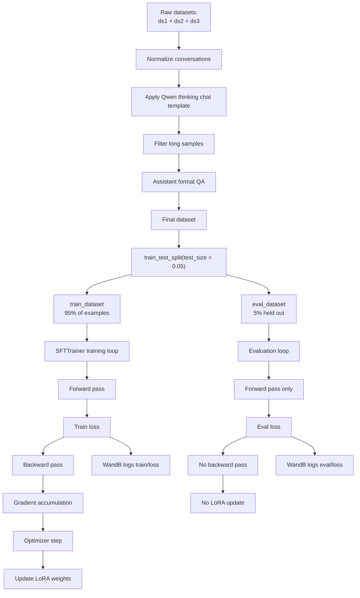
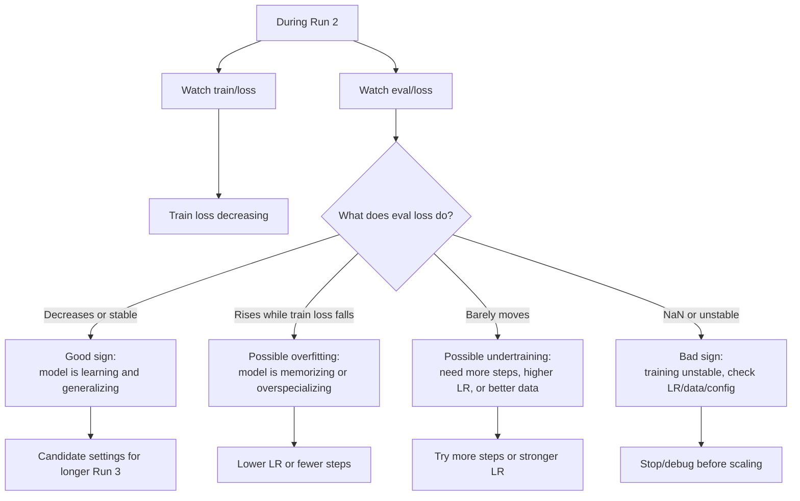

# Eval Split and Eval Loss Explained for Qwen3.5 9B LoRA Fine-Tuning

This note explains the evaluation setup we are adding for Run 2 of the Qwen3.5 9B LoRA/QLoRA fine-tune.

The key idea:

```text
Training loss tells us how well the model is learning the training examples.
Eval loss tells us how well the model performs on held-out examples it did not train on.
```

WandB does **not** provide the eval dataset. WandB only logs and visualizes metrics. The eval dataset comes from splitting our final formatted dataset inside Colab.

---

## 1. Where the eval dataset comes from

Earlier in the notebook, we build one final dataset called:

```python
dataset
```

That final dataset already went through the full pipeline:

```text
ds1 + ds2 + ds3
→ normalized conversations
→ Qwen thinking chat template
→ length filtering
→ assistant format QA
→ final dataset with a text column
```

For Run 2, we split this final `dataset` into two parts:

```python
split_dataset = dataset.train_test_split(test_size=0.05, seed=3407)

train_dataset = split_dataset["train"]
eval_dataset = split_dataset["test"]

print("Train samples:", len(train_dataset))
print("Eval samples:", len(eval_dataset))
```

This means:

```text
95% of the examples become train_dataset.
5% of the examples become eval_dataset.
```

The model trains on `train_dataset`.

The model is evaluated on `eval_dataset`.

The eval examples are held out, meaning the model does not update its LoRA weights on them.

---

## 2. Why split after formatting and filtering?

The split should happen after this pipeline is finished:

```text
raw datasets
→ formatter functions
→ combined dataset
→ apply_chat_template
→ length filter
→ format QA
→ final dataset
```

Then split:

```text
final dataset
→ train_dataset + eval_dataset
```

This matters because both train and eval examples should have the exact same final structure:

```python
{
    "conversations": [...],
    "text": "<|im_start|>user\n...<|im_end|>\n<|im_start|>assistant\n<think>..."
}
```

If we split too early, one side could accidentally skip formatting, filtering, or quality checks.

---

## 3. How the trainer uses the eval dataset

Instead of this:

```python
trainer = SFTTrainer(
    model = model,
    tokenizer = tokenizer,
    train_dataset = dataset,
    eval_dataset = None,
    args = SFTConfig(...),
)
```

Run 2 uses this:

```python
trainer = SFTTrainer(
    model = model,
    tokenizer = tokenizer,
    train_dataset = train_dataset,
    eval_dataset = eval_dataset,
    args = SFTConfig(...),
)
```

So the trainer has two datasets:

```text
train_dataset = examples used to update LoRA weights
eval_dataset  = examples used only to measure held-out loss
```

---

## 4. Eval settings inside SFTConfig

Inside `SFTConfig`, we add:

```python
eval_strategy = "steps"
eval_steps = 50
```

This means:

```text
Every 50 optimizer steps, pause training and run evaluation.
```

For Run 2:

```python
max_steps = 200
eval_steps = 50
```

So evaluation should happen around:

```text
step 50
step 100
step 150
step 200
```

Each time, the trainer calculates `eval_loss` and logs it to WandB.

---

## 5. What happens during evaluation?

During normal training:

```text
batch from train_dataset
→ forward pass
→ calculate training loss
→ backward pass
→ accumulate gradients
→ optimizer step
→ LoRA weights update
```

During evaluation:

```text
batch from eval_dataset
→ forward pass
→ calculate eval loss
→ no backward pass
→ no optimizer step
→ no LoRA update
```

Evaluation is measurement only.

It answers:

```text
How well does the current model predict assistant responses on examples it did not train on?
```

---

## 6. What WandB does

WandB does not create the eval set.

WandB only receives metrics from the trainer and displays them as charts.

With eval enabled, WandB should show metrics like:

```text
train/loss
train/learning_rate
train/grad_norm
eval/loss
```

So the data flow is:

```text
Colab dataset split
→ SFTTrainer trains/evaluates
→ Trainer reports metrics
→ WandB visualizes metrics
```

---

## 7. How to interpret train loss vs eval loss

### Good pattern

```text
train/loss goes down
eval/loss goes down or stays stable
```

This usually means the model is learning useful patterns and generalizing to held-out examples.

### Possible overfitting pattern

```text
train/loss keeps going down
eval/loss starts going up
```

This can mean the model is memorizing the training examples or becoming too specialized.

### Undertraining pattern

```text
train/loss barely moves
eval/loss barely moves
outputs barely change
```

This can mean the run is too short, the learning rate is too low, or the LoRA capacity/data mix is not strong enough.

### Unstable training pattern

```text
loss spikes hard
grad_norm explodes
loss becomes NaN
```

This can mean the learning rate is too high, the data has issues, or the training setup is unstable.

---

## 8. Important limitation of eval loss

Eval loss is useful, but it is not the full story.

Eval loss tells us:

```text
Can the model predict held-out dataset responses better?
```

It does not fully tell us:

```text
Is the model better at coding?
Is the model better at math?
Is the model less verbose?
Does it follow instructions better?
Does it perform better in real use?
```

For that, we also need before-vs-after prompt tests.

---

## 9. Recommended Run 2 eval setup

Use this after final dataset construction and before creating the trainer:

```python
split_dataset = dataset.train_test_split(test_size=0.05, seed=3407)

train_dataset = split_dataset["train"]
eval_dataset = split_dataset["test"]

print("Train samples:", len(train_dataset))
print("Eval samples:", len(eval_dataset))
```

Then use this inside the trainer:

```python
trainer = SFTTrainer(
    model = model,
    tokenizer = tokenizer,
    train_dataset = train_dataset,
    eval_dataset = eval_dataset,
    args = SFTConfig(
        dataset_text_field = "text",
        per_device_train_batch_size = 1,
        gradient_accumulation_steps = 8,
        warmup_steps = 10,
        max_steps = 200,
        learning_rate = 5e-5,
        logging_steps = 1,
        optim = "adamw_8bit",
        weight_decay = 0.001,
        lr_scheduler_type = "linear",
        seed = 3407,
        save_steps = 50,
        save_total_limit = 1,
        save_strategy = "steps",
        report_to = "wandb",
        output_dir = drive_output_path,
        eval_strategy = "steps",
        eval_steps = 50,
    ),
)
```

Then continue with the usual response-only masking:

```python
from unsloth.chat_templates import train_on_responses_only

trainer = train_on_responses_only(
    trainer,
    instruction_part = "<|im_start|>user\n",
    response_part = "<|im_start|>assistant\n<think>",
)
```

Then run label sanity check, then train:

```python
trainer_stats = trainer.train()
```

---

## 10. Mermaid diagram: eval split and training flow



---

## 11. Mermaid diagram: train loss vs eval loss meaning



---

## 12. Simple mental model

```text
Training set = homework the model practices on.
Eval set = quiz questions held back to see if it really learned.
WandB = dashboard that shows the homework loss and quiz loss over time.
```

For Run 2, the eval split is how we move from:

```text
It trained without crashing.
```

to:

```text
It trained, and we have some evidence it generalized to held-out examples.
```
