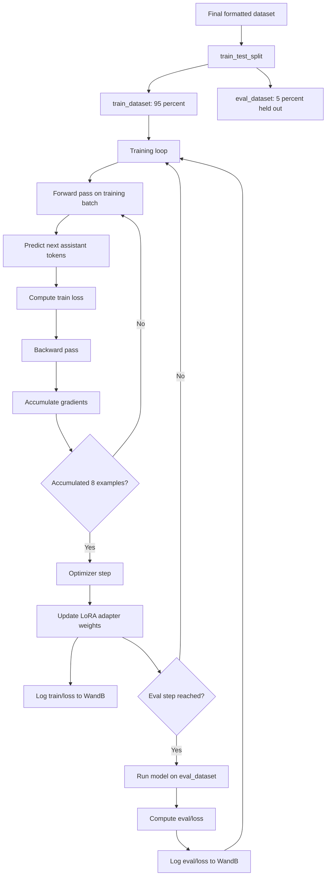
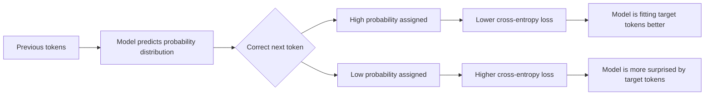
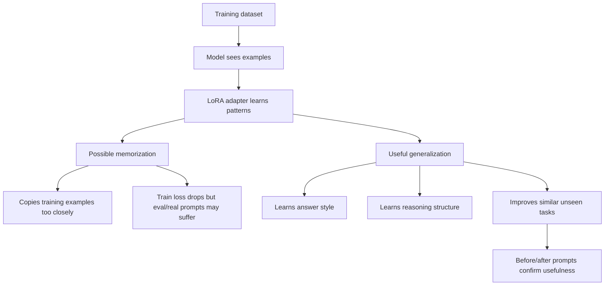

# Train Loss, Eval Loss, and Generalization in LoRA / QLoRA SFT

These notes explain what the training metrics mean during a LoRA or QLoRA supervised fine-tuning run, how to interpret train loss and eval loss, and why a model can improve on questions that were never directly in the dataset.

This is written for the current setup:

```text
Base model: Qwen3.5-9B
Fine-tuning method: LoRA / QLoRA-style SFT
Base model loading: 4-bit
Trainable weights: LoRA adapter only
Training style: response-only supervised fine-tuning
Logging: Weights & Biases
```

---

## 1. What is actually being trained?

In this setup, the original Qwen model weights are frozen. The model itself is not being fully rewritten.

Instead, LoRA adds small trainable adapter weights into specific transformer layers, such as:

```python
target_modules = [
    "q_proj", "k_proj", "v_proj", "o_proj",
    "gate_proj", "up_proj", "down_proj",
]
```

The original layer is roughly:

```text
output = W x
```

With LoRA, it becomes:

```text
output = W x + LoRA_update(x)
```

Where:

```text
W = frozen base model weight
LoRA_update = trainable adapter side-path
```

So during training:

```text
Frozen base model weights: do not change
LoRA adapter weights: update every optimizer step
```

The final behavior comes from:

```text
base model + trained LoRA adapter
```

---

## 2. What does “fitting the training examples” mean?

When people say the model is “fitting” the training examples, they mean:

> The model is getting better at predicting the correct next token for the examples it is training on.

SFT is token-by-token training. The model is not judged on the whole answer as one object. Instead, it predicts the assistant response one token at a time.

Example target answer:

```text
The answer is 60.
```

The model predicts:

```text
The → answer → is → 60 → .
```

At each step, the model assigns probabilities to possible next tokens.

Example:

```text
Correct next token: "60"

Good model prediction:
"60" = 80% probability
"50" = 5% probability
"70" = 3% probability

Bad model prediction:
"60" = 2% probability
"50" = 40% probability
"70" = 20% probability
```

Lower loss means the model is assigning higher probability to the correct next tokens in the dataset.

---

## 3. What is train loss?

`train/loss` measures how well the model is predicting the correct assistant-response tokens on the training examples.

In this setup, because we use `train_on_responses_only`, the model is not supposed to train on the user prompt or most of the chat template. Those ignored tokens are masked with `-100` labels.

So train loss mostly answers this question:

> How well is the model predicting the assistant answers from the training set?

A decreasing train loss usually means:

```text
The optimizer is working
The LoRA adapter is updating
The model is fitting the training examples better
```

But train loss alone does not prove the model is better in real use.

---

## 4. What is eval loss?

`eval/loss` measures how well the model predicts assistant-response tokens on examples it did not train on.

In our setup, the eval dataset comes from splitting the final formatted dataset:

```python
split_dataset = dataset.train_test_split(test_size=0.05, seed=3407)

train_dataset = split_dataset["train"]
eval_dataset = split_dataset["test"]
```

This means:

```text
95% of examples → training set
5% of examples  → held-out evaluation set
```

The model trains on `train_dataset`, but every so often it pauses and measures loss on `eval_dataset`.

Example trainer settings:

```python
eval_strategy = "steps"
eval_steps = 100
```

This means:

```text
Run evaluation every 100 optimizer steps
```

WandB does not create the eval dataset. WandB only logs the metric. The eval data is created inside the notebook from the dataset split.

---

## 5. Train loss vs eval loss

Train loss and eval loss answer different questions.

```text
Train loss:
How well is the model fitting examples it is allowed to train on?

Eval loss:
How well is the model doing on held-out examples from the same dataset distribution?
```

A healthy run usually looks like:

```text
train/loss trends down or stays stable
_eval/loss is close to train/loss
_eval/loss does not explode
_grad_norm stays sane
_no NaN values
```

A suspicious run may look like:

```text
train/loss drops fast
_eval/loss rises a lot
```

That can suggest overfitting.

A bad run may look like:

```text
loss becomes NaN
grad_norm explodes
eval/loss is far higher than train/loss and keeps climbing
training crashes repeatedly
```

---

## 6. What is a “good” loss number?

There is no universal good loss number.

A claim like:

```text
“Loss must be 0.4 to be good.”
```

is too simplified.

Loss depends on many factors:

```text
model size
tokenizer
dataset difficulty
sequence length
whether loss is full-prompt or response-only
short answers vs long reasoning traces
single-domain vs mixed datasets
batch size
learning rate
number of steps
```

For a mixed reasoning/distillation SFT run like this one, losses around:

```text
0.5 to 1.0
```

can be perfectly reasonable.

The trend matters more than the exact number.

For example:

```text
train/loss ≈ 0.72
eval/loss  ≈ 0.67
```

This is a healthy-looking signal because:

```text
both are numeric
eval loss is close to train loss
eval loss is not exploding
gradients are stable
training continues normally
```

That does not prove the model is better, but it means the run is healthy enough to test.

---

## 7. Can loss go above 1 or below 0?

Train loss and eval loss can definitely go above 1.

Loss above 1 is not automatically bad. It may happen early in training or with harder datasets.

Rough intuition:

```text
0.3  = very confident on average
0.7  = healthy / reasonable in many SFT runs
1.0  = still normal
2.0+ = model is struggling more, but not automatically broken
NaN  = bad
```

For normal cross-entropy loss, loss should not go below 0.

The theoretical minimum is:

```text
0
```

A loss near 0 means the model is assigning extremely high probability to the correct tokens.

If you see negative loss in a normal SFT run, something unusual is happening with the objective or logging.

---

## 8. Does lower loss mean the model “understands” better?

Not automatically.

Lower loss means:

> The model became better at predicting the target tokens from the dataset.

That is a real learning signal, but it does not automatically prove deeper reasoning or real-world improvement.

Better interpretation:

```text
Train loss going down:
The model is fitting the training examples.

Eval loss stable or going down:
The model is doing okay on held-out examples from the same dataset distribution.

Before-vs-after prompts improve:
The fine-tune likely improved behavior we care about.
```

Loss tells you whether the run is mechanically healthy. Testing tells you whether the model is actually more useful.

---

## 9. Why can the model improve on questions outside the dataset?

This is the difference between memorization and generalization.

The fine-tune does not need to contain the exact example:

```text
5 * 5 = 25
```

for the model to answer that question correctly.

The base model already has broad capability from pretraining:

```text
language
math
coding
facts
reasoning patterns
instruction-following behavior
```

The LoRA fine-tune nudges behavior:

```text
answer in this format
reason in this style
be more consistent on these task types
follow the desired template
imitate this teacher/data style
```

So for a new question, the model uses:

```text
base model knowledge + LoRA steering
```

The fine-tune can help outside the dataset when the new question is similar in skill, structure, or style to the training examples.

Example:

```text
Training examples:
math word problems
context extraction
reasoning explanations
structured answers

New question:
another math word problem or reasoning task
```

The model may generalize better because it learned the pattern, not because it memorized the exact answer.

---

## 10. Fine-tuning as behavior adjustment

A useful mental model:

```text
Base model = broad general capability
LoRA adapter = behavior steering layer
```

Fine-tuning is not usually “installing a whole new brain.” It is adjusting the model’s probability patterns.

It can make the model more likely to:

```text
use a specific answer structure
produce reasoning in a desired format
handle similar tasks more consistently
avoid certain weak habits
imitate a teacher model’s style
```

So yes, if the model previously got a type of question wrong, and the dataset contains enough similar reasoning patterns, a fine-tune can make it more likely to answer that type correctly in the future.

But it improves probabilities, not guarantees.

---

## 11. What should we check after a run?

After training, check three layers:

### 1. Training health

```text
Did training complete?
Did loss stay numeric?
Did grad_norm stay reasonable?
Did checkpoints/adapters save?
```

### 2. Eval health

```text
Did eval/loss log successfully?
Is eval/loss close to train/loss?
Is eval/loss stable or improving?
```

### 3. Real behavior

Use fixed before-vs-after prompts:

```text
coding prompts
math prompts
reasoning prompts
instruction-following prompts
formatting/conciseness prompts
```

Compare:

```text
base model output
vs
fine-tuned adapter output
```

Loss tells us the run is healthy. Prompt tests tell us whether the fine-tune is useful.

---

## 12. Mermaid diagram: training and eval loop



---

## 13. Mermaid diagram: what loss is measuring



---

## 14. Mermaid diagram: memorization vs generalization



---

## 15. Final mental model

```text
Train loss tells us whether the model is fitting the examples it trains on.

Eval loss tells us whether the model also does well on held-out examples from the same dataset distribution.

Lower loss means the model is assigning higher probability to the correct next tokens.

Lower loss does not automatically prove better real-world reasoning.

Fine-tuning mostly steers behavior. It can improve similar unseen questions because it changes the model's probability patterns, not because it memorizes every possible answer.

The real proof is: stable train/eval loss + better before/after outputs.
```
