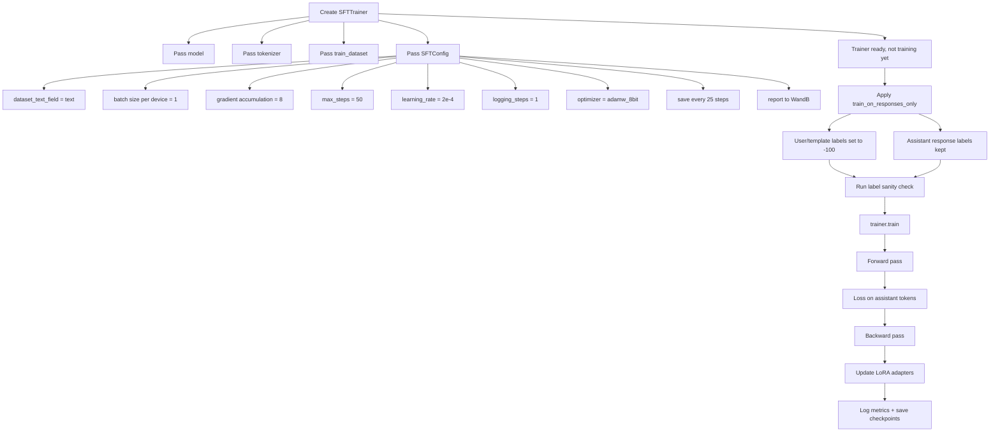

# Qwen LoRA SFT Training Cells: Line-by-Line Explanation

This note explains the three key training-related cells from the notebook:

1. `SFTTrainer(...)` setup
2. `train_on_responses_only(...)` masking
3. label sanity check
4. `trainer.train()` execution

The goal is to understand what each line does and how it connects to LoRA/QLoRA supervised fine-tuning.

---

## 1. Trainer Setup Cell

```python
from trl import SFTTrainer, SFTConfig
```

Imports the Hugging Face TRL supervised fine-tuning tools.

- `SFTTrainer` is the trainer object that runs supervised fine-tuning.
- `SFTConfig` stores the training settings/hyperparameters.
- TRL originally focused on reinforcement learning workflows, but it also provides a strong SFT trainer.

---

```python
trainer = SFTTrainer(
```

Creates the trainer object.

Important: this line does **not** start training yet. It only prepares the trainer with your model, tokenizer, dataset, and training configuration.

---

```python
    model = model,
```

Passes your prepared model into the trainer.

At this point, `model` is not just the raw Qwen model anymore. It is:

```text
4-bit loaded Qwen base model + LoRA adapters attached
```

The base model weights are frozen. The LoRA adapter weights are trainable.

---

```python
    tokenizer = tokenizer,
```

Passes the tokenizer into the trainer.

The tokenizer is responsible for converting formatted text into token IDs. Earlier in the notebook, it was also configured with the Qwen thinking chat template.

The tokenizer knows how to represent text such as:

```text
<|im_start|>user
...
<|im_end|>
<|im_start|>assistant
<think>...</think>
...
<|im_end|>
```

---

```python
    train_dataset = dataset,
```

Passes the final training dataset into the trainer.

This `dataset` should already have gone through:

```text
raw datasets
→ normalized conversations
→ Qwen chat-template serialization
→ length filtering
→ format QA
```

The important field inside the dataset is the `text` column.

---

```python
    eval_dataset = None, # Can set up evaluation!
```

No evaluation dataset is being used for this test run.

That means the trainer will report **training loss**, but not `eval_loss`.

For a serious run, you can split the dataset into train/eval and set something like:

```python
eval_dataset = eval_dataset
```

Then the trainer can report validation/evaluation loss during training.

---

```python
    args = SFTConfig(
```

Starts the training configuration block.

Everything inside `SFTConfig(...)` controls how training runs.

---

```python
        dataset_text_field = "text",
```

Tells the trainer which dataset column contains the training text.

Your dataset rows look conceptually like:

```python
{
    "conversations": [...],
    "text": "<|im_start|>user\n...<|im_start|>assistant\n..."
}
```

This line tells the trainer:

```text
Use dataset["text"] as the training input.
```

---

```python
        per_device_train_batch_size = 1,
```

The GPU processes **1 example at a time**.

Because you are using one GPU, “per device” basically means “per GPU.”

This is memory-safe and important for fitting a large model on an L4 GPU.

---

```python
        gradient_accumulation_steps = 8, # Use GA to mimic batch size!
```

The trainer accumulates gradients for 8 mini-batches before updating the LoRA weights.

With:

```python
per_device_train_batch_size = 1
gradient_accumulation_steps = 8
```

the effective batch size is:

```text
1 × 8 × 1 GPU = 8
```

So the flow is:

```text
Example 1 → calculate gradient → store it
Example 2 → calculate gradient → add it
...
Example 8 → calculate gradient → add it
Then optimizer step → update LoRA adapter once
```

This gives the stability of a larger batch without needing enough VRAM to process 8 examples at the same time.

---

```python
        warmup_steps = 3,
```

The learning rate starts low and warms up over the first 3 optimizer steps.

This helps prevent unstable early training.

For a 50-step test run, 3 warmup steps is about 6% of the run, which is fine.

---

```python
        #warmup_steps = 60,
```

This is commented out and does nothing.

A value like `60` would make sense for a much longer run, but it is too large for a 50-step test. If `warmup_steps = 60` were active with only 50 total steps, the model would spend the entire run warming up.

---

```python
        #num_train_epochs = 2, # Set this for 1 full training run.
```

This is commented out and does nothing.

`num_train_epochs` tells the trainer how many full passes to make over the dataset.

In this test run, you are using `max_steps = 50` instead. `max_steps` is better for a controlled validation run because it stops after a known number of optimizer updates.

---

```python
        max_steps = 50,
```

Stops training after 50 optimizer steps.

This is perfect for a test run because it limits compute cost.

Because your effective batch size is 8, 50 steps means the trainer uses roughly:

```text
50 optimizer steps × 8 examples per step = about 400 example-usages
```

Your dataset has 216 examples, so this is roughly 1.8 epochs.

---

```python
        learning_rate = 2e-4, # Reduce to 2e-5 for long training runs
```

Sets the maximum learning rate.

`2e-4` means:

```text
0.0002
```

For short LoRA/QLoRA test runs, this is a common and reasonable value.

For longer serious runs, a lower learning rate like `2e-5` or `5e-5` is often safer because it reduces the chance of over-updating the adapter.

---

```python
        logging_steps = 1,
```

Logs metrics every optimizer step.

This is why you see charts in W&B and output in Colab every step.

Common logged metrics include:

```text
train/loss
train/learning_rate
train/grad_norm
train/epoch
train/global_step
```

---

```python
        optim = "adamw_8bit",
```

Uses an 8-bit AdamW optimizer.

AdamW is the optimizer that updates the trainable LoRA weights. The `8bit` version reduces memory usage by storing optimizer states more efficiently.

This is useful for large-model fine-tuning because optimizer states can otherwise consume a lot of memory.

---

```python
        weight_decay = 0.001,
```

Adds a small regularization term.

Weight decay slightly discourages weights from growing too large. This can help reduce overfitting and keep training stable.

This value is small and reasonable.

---

```python
        lr_scheduler_type = "linear",
```

Uses a linear learning-rate schedule.

Your learning rate:

1. starts near zero,
2. warms up for `warmup_steps`,
3. then gradually decreases until the end of training.

That is why your W&B `train/learning_rate` chart rises early and then slopes downward.

---

```python
        seed = 3407,
```

Sets the random seed for reproducibility.

This helps make shuffling/training behavior more consistent across runs.

It does not guarantee bit-for-bit identical results in every GPU environment, but it helps.

---

```python
        save_steps = 25,
```

Saves a checkpoint every 25 optimizer steps.

Because your test run has 50 total steps, this means it may save around:

```text
step 25
step 50
```

---

```python
        save_total_limit = 1,
```

Keeps only the latest checkpoint.

This avoids filling disk/Drive with multiple checkpoints.

For a test run, this is good.

---

```python
        save_strategy = "steps",
```

Tells the trainer to save checkpoints based on step count.

This works together with:

```python
save_steps = 25
```

---

```python
        report_to = "wandb", # Can use Weights & Biases
```

Sends training logs to Weights & Biases.

This creates charts such as:

```text
train/loss
train/learning_rate
train/grad_norm
GPU memory usage
GPU power usage
runtime metrics
```

This does not mean W&B is doing the training. The training is still happening on Colab. W&B is only tracking/logging metrics.

---

```python
        output_dir = drive_output_path,
```

Sets the checkpoint output directory.

Earlier, `drive_output_path` should have been set to a Google Drive path, for example:

```python
drive_output_path = "/content/drive/MyDrive/Qwen3.5-9B-test-run-1-checkpoints"
```

This ensures checkpoints survive even if the Colab runtime disconnects.

---

```python
    ),
)
```

Closes the `SFTConfig` and `SFTTrainer` setup.

At this point, the trainer is ready, but training has still not started.

Training starts later with:

```python
trainer_stats = trainer.train()
```

---

## 2. Response-Only Masking Cell

```python
from unsloth.chat_templates import train_on_responses_only
```

Imports Unsloth’s helper for response-only training.

This helper modifies the training labels so the model only learns from assistant responses.

---

```python
trainer = train_on_responses_only(
```

Applies response-only masking to the trainer.

It modifies the trainer’s processed dataset labels.

---

```python
    trainer,
```

Passes in the trainer object you just created.

---

```python
    instruction_part = "<|im_start|>user\n",
```

Tells Unsloth how to identify the beginning of the user/instruction part in the Qwen chat template.

This is important because user tokens should not contribute to the training loss.

---

```python
    response_part = "<|im_start|>assistant\n<think>",
```

Tells Unsloth where the assistant response begins.

Because your dataset was normalized to assistant messages that start with `<think>`, this pattern should match the start of the trainable assistant region.

---

```python
)
```

Closes the response-only masking call.

After this, the trainer’s labels should be set so that:

```text
user/template tokens → ignored with label -100
assistant response tokens → trained normally
```

---

## 3. Label Sanity Check Cell

```python
tokenizer.decode([tokenizer.pad_token_id if x == -100 else x for x in trainer.train_dataset[100]["labels"]]).replace(tokenizer.pad_token, " ")
```

This cell verifies that response-only masking worked.

Breaking it down:

---

```python
trainer.train_dataset[100]["labels"]
```

Gets the labels for example 100 in the training dataset.

Labels are the tokens the model is actually trained on.

---

```python
x == -100
```

Checks whether a token is masked.

In PyTorch cross-entropy training, label `-100` means:

```text
ignore this token when calculating loss
```

---

```python
tokenizer.pad_token_id if x == -100 else x
```

The tokenizer cannot decode `-100` because it is not a real token ID.

So the code temporarily replaces every `-100` with the tokenizer’s pad token ID.

---

```python
tokenizer.decode([...])
```

Converts the label token IDs back into readable text.

---

```python
.replace(tokenizer.pad_token, " ")
```

Replaces visible pad tokens with blank spaces so the output is easier to read.

The blank space at the start of the decoded output usually represents ignored user/template tokens.

---

## What You Want to See

Good output should mostly show assistant-side content, such as:

```text
<think>
...
</think>
final answer
<|im_end|>
```

If you see mostly user prompt text, then response-only masking probably failed.

In your test, the decoded labels showed assistant content about the Sharpe ratio, which means masking worked.

---

## 4. Training Execution Cell

```python
trainer_stats = trainer.train()
```

Starts training.

This is the expensive cell.

The trainer will:

1. load batches from the dataset,
2. tokenize/process them,
3. run the model forward,
4. calculate loss on assistant response tokens only,
5. backpropagate gradients,
6. accumulate gradients for 8 mini-steps,
7. update the LoRA adapter weights,
8. log metrics,
9. save checkpoints.

The returned object is stored in `trainer_stats`.

After training, you can inspect metrics with:

```python
trainer_stats.metrics
```

Useful values include:

```text
train_loss
train_runtime
train_samples_per_second
train_steps_per_second
```

---

## Key Mental Model

```text
SFTTrainer setup = prepare training
train_on_responses_only = mask labels so only assistant responses train
label sanity check = verify masking worked
trainer.train() = actually update LoRA adapter weights
```

---

## Mermaid Diagram: Training Cell Flow


