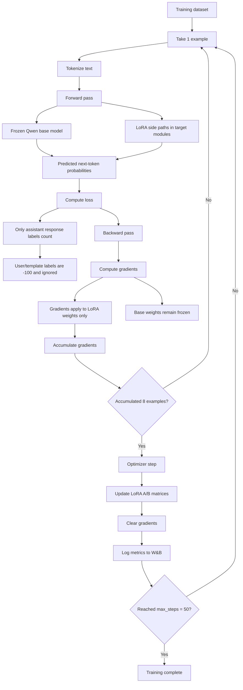
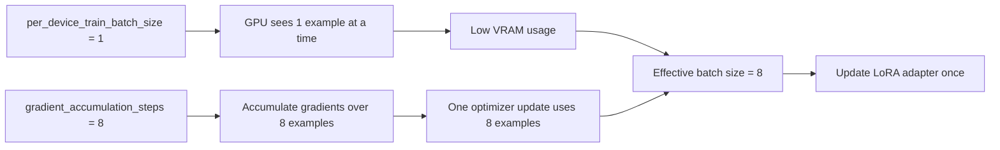
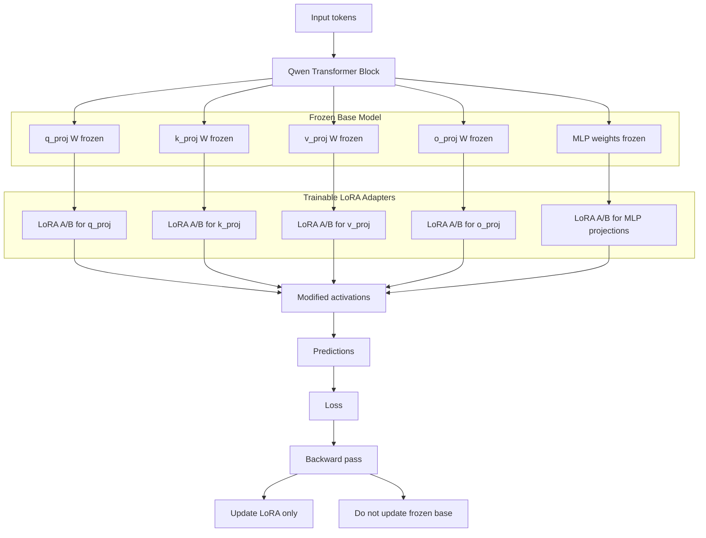

# LoRA / QLoRA SFT Training: Forward Pass, Backward Pass, and Updates Explained

This note explains what happens during the actual training step in your Qwen LoRA/QLoRA SFT run.

Your setup:

```text
Base model: Qwen3.5-9B
Loading: 4-bit
Fine-tuning method: LoRA / QLoRA-style SFT
Trainable weights: LoRA adapter weights only
Frozen weights: original Qwen base model weights
Batch size per device: 1
Gradient accumulation steps: 8
Effective batch size: 8
Max steps: 50
```

---

## 1. What Is Being Trained?

The original Qwen model is mostly frozen.

That means the huge base model weights do not change.

Instead, LoRA adds small trainable matrices into selected modules like:

```text
q_proj
k_proj
v_proj
o_proj
gate_proj
up_proj
down_proj
```

A normal layer is roughly:

```text
output = W x
```

With LoRA, it becomes:

```text
output = W x + scale × B A x
```

Where:

```text
W = original frozen base weight
A = trainable LoRA down-projection
B = trainable LoRA up-projection
```

Training updates `A` and `B`, not `W`.

---

## 2. What Is a Forward Pass?

A forward pass is when one training example is sent through the model to produce predictions.

Example training text:

```text
<|im_start|>user
What is a Sharpe ratio?
<|im_end|>
<|im_start|>assistant
<think>
...
</think>
A Sharpe ratio is...
<|im_end|>
```

The tokenizer converts that text into token IDs.

The model then predicts the next token at each position.

Conceptually:

```text
input tokens → model → predicted next-token probabilities
```

During the forward pass:

1. tokens enter the frozen Qwen base model,
2. activations pass through transformer layers,
3. LoRA side paths modify selected layer outputs,
4. the model predicts next tokens.

---

## 3. What Is Loss?

Loss measures how wrong the model’s predictions are.

If the model predicts the correct next token with high confidence, loss is lower.

If it predicts poorly, loss is higher.

In your setup, response-only masking means loss is calculated only on assistant response tokens.

That means:

```text
user prompt tokens → ignored
chat template tokens before assistant → ignored
assistant answer tokens → trained
```

Ignored labels are set to:

```text
-100
```

So the model is punished for getting assistant response tokens wrong, not for failing to predict the user prompt.

---

## 4. What Is a Backward Pass?

A backward pass calculates gradients.

Gradients answer the question:

```text
How should each trainable weight change to reduce loss?
```

Because the base model is frozen, gradients do not update the original Qwen weights.

Only the LoRA weights receive updates.

So the backward pass says:

```text
LoRA A/B matrices: here is how to change to reduce loss
Base model W matrices: do not change
```

---

## 5. What Is Gradient Accumulation?

Your GPU processes one example at a time:

```python
per_device_train_batch_size = 1
```

But you set:

```python
gradient_accumulation_steps = 8
```

So instead of updating after every single example, the trainer accumulates gradients over 8 examples.

The flow is:

```text
Example 1 → forward → loss → backward → store gradient
Example 2 → forward → loss → backward → add gradient
Example 3 → forward → loss → backward → add gradient
Example 4 → forward → loss → backward → add gradient
Example 5 → forward → loss → backward → add gradient
Example 6 → forward → loss → backward → add gradient
Example 7 → forward → loss → backward → add gradient
Example 8 → forward → loss → backward → add gradient

Then optimizer step → update LoRA weights once
```

That is why:

```text
effective batch size = 1 × 8 × 1 GPU = 8
```

The GPU only needs memory for one example at a time, but each update is based on 8 examples.

---

## 6. What Is an Optimizer Step?

After 8 accumulated examples, the optimizer updates the trainable LoRA weights.

You are using:

```python
optim = "adamw_8bit"
```

AdamW is the optimizer. The 8-bit version saves memory.

The optimizer step updates only the trainable adapter parameters.

Conceptually:

```text
LoRA weights = LoRA weights - learning_rate × gradient_adjustment
```

The base model weights remain frozen.

---

## 7. What Is a Training Step?

In your logs, one `global_step` means one optimizer update.

Because you accumulate 8 examples before updating, one global step equals roughly 8 examples processed.

So:

```text
global_step 1 = after 8 examples
 global_step 2 = after 16 examples
 global_step 3 = after 24 examples
```

With:

```python
max_steps = 50
```

training stops after 50 optimizer updates.

That is approximately:

```text
50 × 8 = 400 example-usages
```

Because your dataset has 216 examples, this is around 1.8 passes through the dataset.

---

## 8. What Do the W&B Metrics Mean?

### `train/loss`

How wrong the model is on assistant response tokens.

For a tiny test run, it can bounce around. You mainly want:

```text
numeric loss
no NaN
no explosion upward forever
```

---

### `train/learning_rate`

Shows the learning rate schedule.

In your run:

1. it starts near 0,
2. warms up for 3 steps,
3. then decreases linearly.

This is expected.

---

### `train/grad_norm`

Shows gradient size.

Small spikes are normal.

Bad signs would be:

```text
grad_norm becomes huge repeatedly
loss becomes NaN
training crashes
```

---

### `train/global_step`

Number of optimizer updates completed.

It should go from 1 to 50.

---

### `train/epoch`

Approximate pass-through progress over the dataset.

If one epoch is around 27 optimizer steps and you train for 50 steps, you end around 1.8 epochs.

---

## 9. Why GPU RAM Is High

Training uses more memory than inference because it needs:

```text
model weights
LoRA weights
optimizer states
activations for backpropagation
gradients
batch tensors
KV/attention-related memory depending on implementation
```

Your 9B model on L4 is tight but working.

If it OOMs in the future, reduce:

```text
max_seq_length
MAX_CONTEXT_WINDOW
LoRA rank
batch size
```

The first emergency change is usually:

```python
max_seq_length = 4096
MAX_CONTEXT_WINDOW = 4096
```

---

## 10. The Whole Training Loop in Plain English

For each optimizer step:

```text
1. Read 1 example
2. Run it through the model
3. Calculate loss on assistant response tokens
4. Backpropagate gradients into LoRA weights
5. Repeat until 8 examples have contributed gradients
6. Update LoRA adapter once
7. Log loss/lr/grad_norm to W&B
8. Save checkpoint if needed
9. Continue until max_steps = 50
```

---

## Mermaid Diagram: LoRA Training Loop



---

## Mermaid Diagram: Batch Size vs Effective Batch Size



---

## Mermaid Diagram: What Updates and What Stays Frozen


