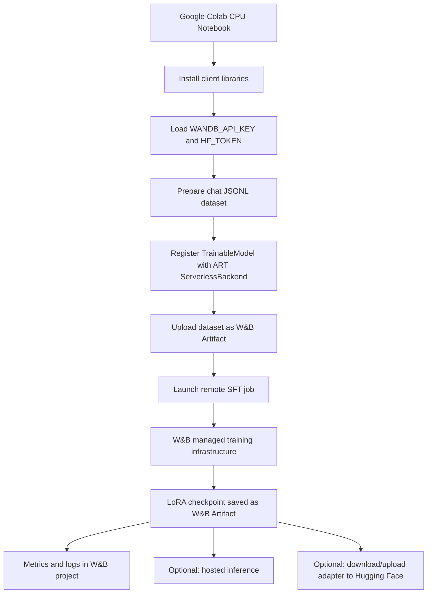
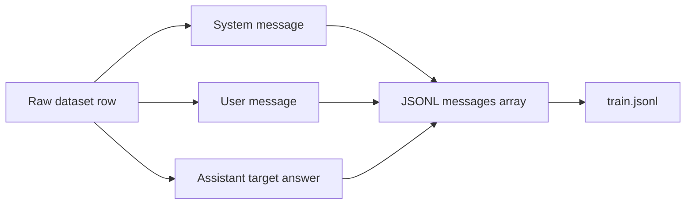
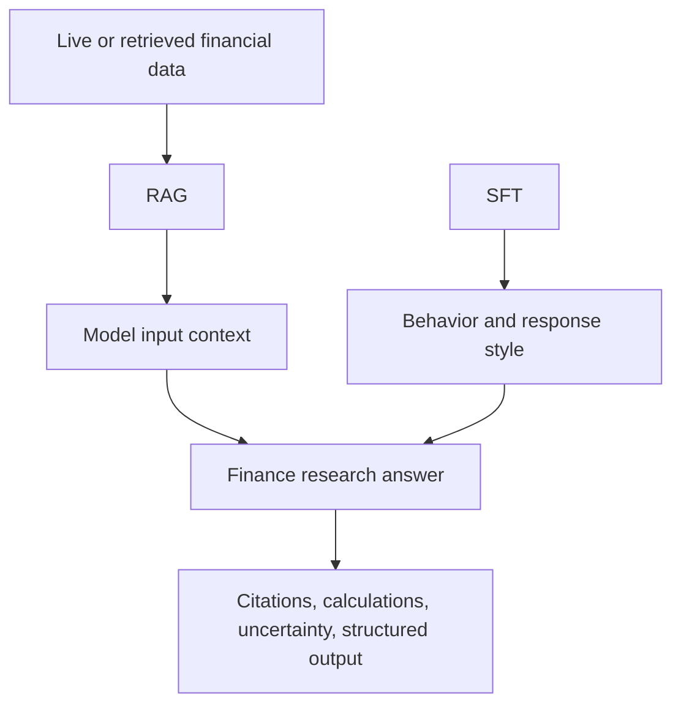
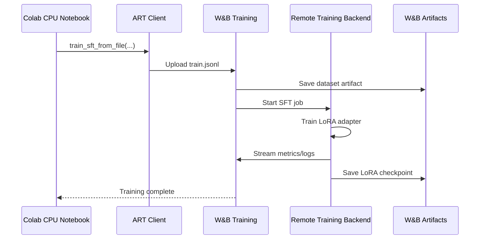
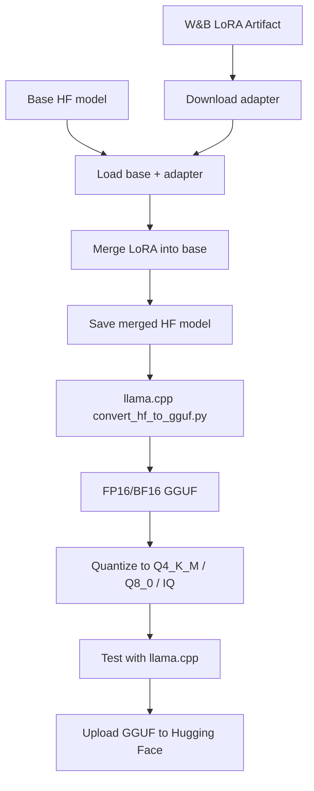
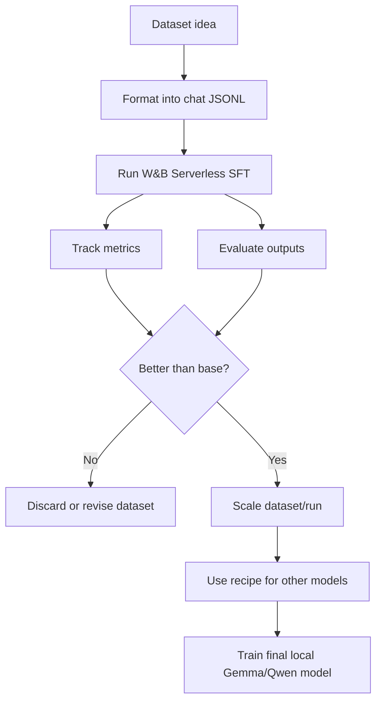

# End-to-End W&B Serverless SFT Run Guide

This guide walks through a clean end-to-end **Supervised Fine-Tuning (SFT)** run using **Weights & Biases Training / ART ServerlessBackend** from a **CPU-only Google Colab notebook**.

The goal is:

```text
Google Colab CPU notebook
→ authenticate with W&B + Hugging Face
→ create/prepare SFT JSONL dataset
→ register a supported W&B Training model
→ launch serverless SFT
→ track metrics in W&B
→ locate the trained LoRA checkpoint/artifact
→ optionally test the checkpoint through W&B Inference
→ optionally upload/export the adapter to Hugging Face
```

This guide assumes the notebook path works cleanly on the first try. It intentionally does **not** include the debugging/testing process used to discover which models are supported.

---

## 1. High-Level Architecture

W&B Serverless SFT lets Colab act as the control plane while W&B handles the actual remote training job.



The important idea is that **Colab does not need a GPU**. The notebook only prepares data, authenticates, submits the job, and inspects outputs.

---

## 2. What W&B Handles vs What You Control

### You Control

You still control the core experiment choices:

| Area | Example |
|---|---|
| W&B entity/project | `models-ontario-tech-university/us-finance-sft-lab` |
| Base model | `Qwen/Qwen3-30B-A3B-Instruct-2507` |
| Model/run name | `qwen3-30b-a3b-us-finance-sft-001` |
| Dataset file | `train.jsonl` |
| Epochs | `1`, `2`, etc. |
| Batch size | `2`, `4`, etc. |
| Peak learning rate | `5e-5`, `2e-5`, etc. |
| Warmup ratio | `0.05` |
| LR schedule | `cosine` |

### W&B / ART Handles

The serverless backend abstracts away most infrastructure and lower-level training plumbing:

| Area | Handled by W&B/ART |
|---|---|
| Remote GPU infrastructure | Yes |
| Model loading | Yes |
| Training job orchestration | Yes |
| Dataset artifact upload | Yes |
| LoRA checkpoint storage | Yes |
| W&B metric logging | Yes |
| Checkpoint artifact versioning | Yes |
| Training logs | Yes |

Compared to a local Unsloth/TRL run, this path exposes fewer low-level knobs such as LoRA target modules, quantized model loading, optimizer internals, and gradient accumulation. That is useful for rapid dataset testing because the workflow is much simpler.

---

## 3. Recommended Notebook Structure

Use a clean Colab notebook with these cells:

```text
Cell 1  - Install dependencies
Cell 2  - Authenticate W&B and Hugging Face
Cell 3  - Define experiment config
Cell 4  - Create or load SFT JSONL dataset
Cell 5  - Register model with W&B ServerlessBackend
Cell 6  - Launch SFT job
Cell 7  - List checkpoints/artifacts
Cell 8  - Optional inference test
Cell 9  - Optional Hugging Face upload
```

---

# Cell 1: Install Dependencies

Use a CPU runtime in Colab. Do **not** select a GPU runtime unless you later plan to merge/convert models locally inside Colab.

```python
# Cell 1 — CPU-safe setup for W&B Serverless SFT

!pip install -U openpipe-art wandb datasets huggingface_hub openai

import os
import sys
import platform

print("Python:", sys.version)
print("Platform:", platform.platform())
print("CUDA_VISIBLE_DEVICES:", os.environ.get("CUDA_VISIBLE_DEVICES", "not set"))
print("Setup complete. This notebook is intended to run on CPU.")
```

### What this installs

| Package | Purpose |
|---|---|
| `openpipe-art` | ART framework used for W&B serverless training |
| `wandb` | W&B auth, runs, artifacts, metrics |
| `datasets` | Loading/preparing datasets |
| `huggingface_hub` | Optional HF upload/download |
| `openai` | Optional W&B Inference API calls |

---

# Cell 2: Authenticate W&B and Hugging Face

This assumes your Colab secrets are stored as:

```text
WANDB_API_KEY
HF_TOKEN
```

```python
# Cell 2 — Authentication: W&B + Hugging Face

import os
import wandb
from google.colab import userdata
from huggingface_hub import login as hf_login, whoami

# Load secrets from Google Colab Secrets
os.environ["WANDB_API_KEY"] = userdata.get("WANDB_API_KEY")
os.environ["HF_TOKEN"] = userdata.get("HF_TOKEN")

# Fail early if a secret is missing
assert os.environ["WANDB_API_KEY"], "Missing WANDB_API_KEY in Colab Secrets"
assert os.environ["HF_TOKEN"], "Missing HF_TOKEN in Colab Secrets"

# Login to W&B
wandb.login(key=os.environ["WANDB_API_KEY"])

# Login to Hugging Face
hf_login(token=os.environ["HF_TOKEN"])

# Confirm Hugging Face identity
hf_user = whoami(token=os.environ["HF_TOKEN"])
print("HF user:", hf_user["name"])

print("Auth complete: W&B and Hugging Face tokens loaded successfully.")
```

### Why this matters

W&B uses `WANDB_API_KEY` for:

```text
training job submission
artifact upload
run logging
checkpoint access
optional W&B Inference
```

Hugging Face uses `HF_TOKEN` for:

```text
loading private datasets or models
creating repos
uploading adapter/checkpoint files
optional model backups
```

---

# Cell 3: Define Experiment Config

This cell is the central config for the run.

```python
# Cell 3 — Experiment config for W&B Serverless SFT training

WANDB_ENTITY = "models-ontario-tech-university"
WANDB_PROJECT = "us-finance-sft-lab"

MODEL_NAME = "qwen3-30b-a3b-us-finance-sft-001"

# Supported W&B Training / ART Serverless model
BASE_MODEL = "Qwen/Qwen3-30B-A3B-Instruct-2507"

# Optional later Hugging Face repos
HF_ADAPTER_REPO_ID = "rjrxter/qwen3-30b-a3b-us-finance-sft-lora"
HF_GGUF_REPO_ID = "rjrxter/qwen3-30b-a3b-us-finance-sft-gguf"

# SFT settings
SFT_EPOCHS = 1
SFT_BATCH_SIZE = 2
SFT_PEAK_LR = 5e-5
SFT_WARMUP_RATIO = 0.05
SFT_SCHEDULE_TYPE = "cosine"

# Dataset limit for initial runs. Set to None for full dataset.
MAX_TRAIN_EXAMPLES = 500

print("W&B entity:", WANDB_ENTITY)
print("W&B project:", WANDB_PROJECT)
print("Model name:", MODEL_NAME)
print("Base model:", BASE_MODEL)
print("HF adapter repo:", HF_ADAPTER_REPO_ID)
print("HF GGUF repo:", HF_GGUF_REPO_ID)
print("Epochs:", SFT_EPOCHS)
print("Batch size:", SFT_BATCH_SIZE)
print("Peak LR:", SFT_PEAK_LR)
print("Warmup ratio:", SFT_WARMUP_RATIO)
print("Schedule:", SFT_SCHEDULE_TYPE)
print("Max train examples:", MAX_TRAIN_EXAMPLES)
```

## Config Explanation

### `WANDB_ENTITY`

This should be your W&B username or team/org. For academic credits or organization-level inference/training, use the organization entity.

Example:

```python
WANDB_ENTITY = "models-ontario-tech-university"
```

### `WANDB_PROJECT`

This groups all related runs together in W&B.

Example:

```python
WANDB_PROJECT = "us-finance-sft-lab"
```

### `MODEL_NAME`

This is the unique name for this trainable model/checkpoint line.

Good naming pattern:

```text
<base-model>-<domain>-<run-type>-<version>
```

Example:

```python
MODEL_NAME = "qwen3-30b-a3b-us-finance-sft-001"
```

### `BASE_MODEL`

This must be a model supported by W&B Training / ART ServerlessBackend.

Example:

```python
BASE_MODEL = "Qwen/Qwen3-30B-A3B-Instruct-2507"
```

### Training Hyperparameters

| Variable | Meaning |
|---|---|
| `SFT_EPOCHS` | Number of passes through the dataset |
| `SFT_BATCH_SIZE` | Number of examples per batch |
| `SFT_PEAK_LR` | Highest learning rate during training |
| `SFT_WARMUP_RATIO` | Fraction of training used for LR warmup |
| `SFT_SCHEDULE_TYPE` | LR schedule, commonly `cosine` |

For first serious tests, good starting values are:

```python
SFT_EPOCHS = 1
SFT_BATCH_SIZE = 2
SFT_PEAK_LR = 2e-5  # or 5e-5 for a stronger update
SFT_WARMUP_RATIO = 0.05
SFT_SCHEDULE_TYPE = "cosine"
```

---

## 4. Dataset Format

ART SFT expects JSONL where each line contains a `messages` array.

Each row should look like:

```json
{"messages":[{"role":"system","content":"You are a helpful assistant."},{"role":"user","content":"What is LoRA?"},{"role":"assistant","content":"LoRA trains small adapter weights instead of updating all model weights."}]}
```

The final message should be the assistant answer. The training objective is to teach the model how to produce that assistant response.



---

# Cell 4A: Create a Small Example Dataset

Use this version for a clean first run or smoke test.

```python
# Cell 4A — Create SFT JSONL dataset

import json
from pathlib import Path

TRAIN_JSONL_PATH = "train.jsonl"

SYSTEM_PROMPT = (
    "You are a U.S. public equities research assistant. "
    "Prioritize SEC filings, U.S. GAAP, NYSE/NASDAQ listed companies, and American market context. "
    "Separate facts, calculations, interpretation, and uncertainty. "
    "Do not invent missing data and do not give unsupported buy/sell recommendations."
)

examples = [
    {
        "user": "Using retrieved SEC filing evidence, explain how to evaluate whether a company's gross margin improved year over year.",
        "assistant": (
            "To evaluate whether gross margin improved year over year, first extract revenue and gross profit for the current and prior-year periods from the retrieved SEC filing. "
            "Then calculate gross margin as gross profit divided by revenue for each period. Compare the two percentages and state the difference in percentage points. "
            "The answer should cite the filing evidence, show the formula, and separate the numerical result from interpretation. If either revenue or gross profit is missing, say that the margin cannot be calculated from the provided context."
        ),
    },
    {
        "user": "What should a finance research assistant do if retrieved RAG context does not contain the requested 10-K data?",
        "assistant": (
            "It should clearly say that the provided context does not contain enough information to answer. It should not invent numbers or rely on memory. "
            "A good response should identify the missing fields, explain what filing or period is needed, and ask for the relevant 10-K, 10-Q, earnings transcript, or financial statement data."
        ),
    },
    {
        "user": "Explain the difference between facts and interpretation in a stock research note.",
        "assistant": (
            "Facts are directly supported by evidence, such as revenue, operating income, debt levels, filing dates, segment results, or management statements. "
            "Interpretation is the analyst's explanation of what those facts may imply, such as whether margin pressure appears temporary or whether growth quality is improving. "
            "A reliable research note should label both clearly and cite evidence for factual claims."
        ),
    },
]

if MAX_TRAIN_EXAMPLES is not None:
    examples = examples[:MAX_TRAIN_EXAMPLES]

with open(TRAIN_JSONL_PATH, "w", encoding="utf-8") as f:
    for ex in examples:
        row = {
            "messages": [
                {"role": "system", "content": SYSTEM_PROMPT},
                {"role": "user", "content": ex["user"]},
                {"role": "assistant", "content": ex["assistant"]},
            ]
        }
        f.write(json.dumps(row, ensure_ascii=False) + "\n")

print(f"Created: {TRAIN_JSONL_PATH}")
print(f"Examples written: {len(examples)}")

print("\nPreview first line:\n")
with open(TRAIN_JSONL_PATH, "r", encoding="utf-8") as f:
    print(f.readline().strip())
```

---

# Cell 4B: Convert a Hugging Face Dataset to SFT JSONL

Use this pattern once you are ready to train on a real dataset.

```python
# Cell 4B — Convert Hugging Face dataset to ART/W&B chat JSONL

import json
from datasets import load_dataset

TRAIN_JSONL_PATH = "train.jsonl"

DATASET_NAME = "your-dataset-name-here"
DATASET_SPLIT = "train"

SYSTEM_PROMPT = (
    "You are a U.S. public equities research assistant. "
    "Prioritize SEC filings, U.S. GAAP, NYSE/NASDAQ listed companies, and American market context. "
    "Separate facts, calculations, interpretation, and uncertainty. "
    "Do not invent missing data and do not give unsupported buy/sell recommendations."
)

dataset = load_dataset(DATASET_NAME, split=DATASET_SPLIT)

if MAX_TRAIN_EXAMPLES is not None:
    dataset = dataset.select(range(min(MAX_TRAIN_EXAMPLES, len(dataset))))


def row_to_messages(row):
    """
    Adjust these field mappings to match the dataset.
    Common field names:
      - instruction / prompt / question
      - output / response / answer
      - context / retrieved_context / evidence
    """

    instruction = row.get("instruction") or row.get("prompt") or row.get("question")
    answer = row.get("output") or row.get("response") or row.get("answer")
    context = row.get("context") or row.get("retrieved_context") or row.get("evidence")

    if context:
        user_content = f"Retrieved context:\n{context}\n\nUser question:\n{instruction}"
    else:
        user_content = instruction

    return {
        "messages": [
            {"role": "system", "content": SYSTEM_PROMPT},
            {"role": "user", "content": user_content},
            {"role": "assistant", "content": answer},
        ]
    }

written = 0
with open(TRAIN_JSONL_PATH, "w", encoding="utf-8") as f:
    for row in dataset:
        item = row_to_messages(row)

        user_msg = item["messages"][1]["content"]
        assistant_msg = item["messages"][2]["content"]

        if user_msg and assistant_msg:
            f.write(json.dumps(item, ensure_ascii=False) + "\n")
            written += 1

print(f"Created: {TRAIN_JSONL_PATH}")
print(f"Examples written: {written}")

print("\nPreview first line:\n")
with open(TRAIN_JSONL_PATH, "r", encoding="utf-8") as f:
    print(f.readline().strip())
```

---

## 5. Finance Dataset Design Principles

For finance SFT, do **not** try to memorize current stock facts. Stock data, SEC filings, and market conditions change constantly.

Use RAG for facts:

```text
SEC filings
10-K / 10-Q data
8-Ks
earnings transcripts
stock prices
ratios
news
company guidance
analyst notes
```

Use SFT for behavior:

```text
how to read filings
how to cite evidence
how to perform calculations
how to separate fact from interpretation
how to avoid unsupported claims
how to handle missing context
how to write a structured research note
how to reason about U.S. public equities
```



---

# Cell 5: Register the Trainable Model

This creates/registers the model with W&B Training through ART ServerlessBackend.

```python
# Cell 5 — Register model with W&B ServerlessBackend

import art
from art.serverless.backend import ServerlessBackend

backend = ServerlessBackend()

model = art.TrainableModel(
    name=MODEL_NAME,
    project=WANDB_PROJECT,
    base_model=BASE_MODEL,
    entity=WANDB_ENTITY,
)

print("Registering model with W&B ServerlessBackend...")
print("Entity:", WANDB_ENTITY)
print("Project:", WANDB_PROJECT)
print("Model name:", MODEL_NAME)
print("Base model:", BASE_MODEL)

await model.register(backend)

print("Model registered successfully.")
```

Expected successful output:

```text
Registering model with W&B ServerlessBackend...
Entity: models-ontario-tech-university
Project: us-finance-sft-lab
Model name: qwen3-30b-a3b-us-finance-sft-001
Base model: Qwen/Qwen3-30B-A3B-Instruct-2507
Model registered successfully.
```

---

# Cell 6: Launch the SFT Job

This sends the JSONL dataset to W&B, launches the serverless training job, and logs metrics.

```python
# Cell 6 — Run W&B Serverless SFT

from art.utils.sft import train_sft_from_file

print("Starting SFT run...")
print("Model:", MODEL_NAME)
print("Base model:", BASE_MODEL)
print("Training file:", TRAIN_JSONL_PATH)
print("Epochs:", SFT_EPOCHS)
print("Batch size:", SFT_BATCH_SIZE)
print("Peak LR:", SFT_PEAK_LR)
print("Schedule:", SFT_SCHEDULE_TYPE)
print("Warmup ratio:", SFT_WARMUP_RATIO)

await train_sft_from_file(
    model=model,
    file_path=TRAIN_JSONL_PATH,
    epochs=SFT_EPOCHS,
    batch_size=SFT_BATCH_SIZE,
    peak_lr=SFT_PEAK_LR,
    schedule_type=SFT_SCHEDULE_TYPE,
    warmup_ratio=SFT_WARMUP_RATIO,
    verbose=True,
)

print("SFT run completed.")
```

## What Happens During This Cell



## Metrics You May See

| Metric | Meaning |
|---|---|
| `loss/train` | Training loss on assistant tokens |
| `learning_rate` | Current LR at logged step |
| `grad_norm` | Gradient norm, useful for spotting instability |
| `training_step` | Step count |
| `avg_trainer_tok_per_s` | Approximate training throughput |
| `num_dropped_trajectories` | Rows dropped due to formatting or processing issues |
| `num_gradient_steps` | Number of gradient updates |
| `num_tokens` | Tokens processed |

For a small smoke run, metrics are not very meaningful. For a real run, compare runs using the same eval set and behavior tests.

---

## 6. Recommended Experiment Patterns

### Learning Rate A/B Test

Try two runs with identical data:

```python
SFT_PEAK_LR = 5e-5
```

then:

```python
SFT_PEAK_LR = 2e-5
```

Compare:

```text
training loss
manual eval outputs
format following
hallucination behavior
financial calculation consistency
citation discipline
```

### Dataset Format A/B Test

Test different user prompt structures:

```text
Format A:
Retrieved context first, question second

Format B:
Question first, retrieved context second

Format C:
Structured sections: Context, Task, Output Requirements
```

### Domain Dataset A/B Test

Compare:

```text
SEC filing QA data
financial numerical reasoning data
earnings call QA data
research report style data
synthetic RAG-grounded data
```

---

# Cell 7: List Checkpoints

After training completes, list model checkpoints.

```python
# Cell 7 — List model checkpoints after SFT

print("Listing checkpoints for trained model...")

checkpoints = await model.list_checkpoints()

print(f"Found {len(checkpoints)} checkpoint(s):\n")

for i, ckpt in enumerate(checkpoints):
    print(f"Checkpoint {i}")
    print(ckpt)
    print()
```

If the ART helper changes or does not expose `list_checkpoints`, use the W&B project UI to inspect:

```text
Project page
→ Runs
→ Your SFT run
→ Artifacts / Output artifacts
→ LoRA checkpoint artifact
```

You are looking for an artifact URI shaped like:

```text
wandb-artifact:///ENTITY/PROJECT/MODEL_NAME:VERSION_OR_STEP
```

---

# Cell 8: Optional W&B Inference Test

Once you have a trained checkpoint URI, you can test the trained model through W&B Inference if your org has inference enabled.

```python
# Cell 8 — Optional inference test with a trained checkpoint

from openai import OpenAI
import os

client = OpenAI(
    base_url="https://api.inference.wandb.ai/v1",
    api_key=os.environ["WANDB_API_KEY"],
    project=f"{WANDB_ENTITY}/{WANDB_PROJECT}",
)

# Replace this with your actual checkpoint artifact URI
TRAINED_MODEL_URI = "wandb-artifact:///models-ontario-tech-university/us-finance-sft-lab/qwen3-30b-a3b-us-finance-sft-001:latest"

response = client.chat.completions.create(
    model=TRAINED_MODEL_URI,
    messages=[
        {
            "role": "system",
            "content": "You are a U.S. public equities research assistant. Give concise, evidence-aware answers."
        },
        {
            "role": "user",
            "content": "What should you do if the retrieved SEC filing context is missing the revenue number needed for a margin calculation?"
        },
    ],
    max_tokens=500,
    temperature=0,
)

msg = response.choices[0].message
print("finish_reason:", response.choices[0].finish_reason)
print("content:", msg.content)
```

### Note on reasoning models

Some hosted reasoning models may spend tokens on internal reasoning before producing final content. If `content` is `None` and `finish_reason` is `length`, increase `max_tokens`.

---

# Cell 9: Optional Upload Adapter to Hugging Face

If you download the trained LoRA artifact locally as a folder, you can upload it to Hugging Face.

```python
# Cell 9 — Optional upload downloaded LoRA adapter folder to Hugging Face

from huggingface_hub import HfApi, create_repo
import os

api = HfApi(token=os.environ["HF_TOKEN"])

LOCAL_ADAPTER_DIR = "./downloaded_lora_adapter"  # replace with actual downloaded artifact folder

create_repo(
    repo_id=HF_ADAPTER_REPO_ID,
    repo_type="model",
    private=False,
    exist_ok=True,
    token=os.environ["HF_TOKEN"],
)

api.upload_folder(
    folder_path=LOCAL_ADAPTER_DIR,
    repo_id=HF_ADAPTER_REPO_ID,
    repo_type="model",
    token=os.environ["HF_TOKEN"],
)

print("Uploaded adapter to:", HF_ADAPTER_REPO_ID)
```

A good adapter-only Hugging Face repo should include:

```text
adapter_model.safetensors
adapter_config.json
README.md
```

The model card should clearly say:

```text
Base model: Qwen/Qwen3-30B-A3B-Instruct-2507
Training method: W&B Serverless SFT / ART
Adapter type: LoRA
Dataset: describe dataset/source
Intended use: research/testing, not financial advice
```

---

## 7. Optional GGUF Path

For local inference, the usual path is:

```text
W&B LoRA artifact
→ download PEFT adapter
→ load base model + adapter in Transformers/PEFT
→ merge adapter into base model
→ save merged BF16/FP16 model
→ convert merged model to GGUF with llama.cpp
→ quantize GGUF
→ test locally
→ upload GGUF to Hugging Face
```



For large models, do not expect this merge/convert path to fit in CPU-only Colab. Use a proper machine with enough RAM/storage, or do it locally if your hardware can handle it.

---

## 8. Finance-Specific Output Template

For a U.S. stock research assistant, a strong answer format is:

```text
Direct Answer
- One or two sentence answer.

Evidence
- Cite retrieved filing/transcript chunks.

Calculations
- Show formulas and numbers.

Interpretation
- Explain what the facts may imply.

Uncertainty / Missing Data
- State what cannot be concluded from the provided context.

Not Investment Advice
- Avoid unsupported buy/sell calls.
```

You can train examples to follow this structure.

---

## 9. Common Run Naming Scheme

Use names that make later comparison easy:

```text
qwen3-30b-a3b-us-finance-sft-secqa-lr2e5-v001
qwen3-30b-a3b-us-finance-sft-secqa-lr5e5-v002
qwen3-30b-a3b-us-finance-sft-ragformatA-v003
qwen3-30b-a3b-us-finance-sft-ragformatB-v004
```

Recommended fields to encode:

```text
base model
domain
dataset family
learning rate
version
```

---

## 10. Evaluation Plan

Do not rely only on training loss. Build a small, consistent eval set.

### Eval Categories

```text
SEC filing extraction
financial calculation
missing-data refusal
citation discipline
fact vs interpretation separation
research-note formatting
U.S. market context
RAG context obedience
```

### Example Eval Prompt

```text
Retrieved context:
Company X reported revenue of $10.0B and gross profit of $4.2B in FY2024. In FY2023, revenue was $8.0B and gross profit was $3.6B.

Question:
Did gross margin improve year over year? Show the calculation.
```

Expected behavior:

```text
FY2024 gross margin = 4.2 / 10.0 = 42.0%
FY2023 gross margin = 3.6 / 8.0 = 45.0%
Gross margin declined by 3.0 percentage points.
```

---

## 11. Final Mental Model

W&B Serverless SFT is best used as a **dataset and behavior testing lab**.



Use W&B to answer:

```text
Does this dataset actually improve the model?
Does this format improve RAG obedience?
Does this LR/epoch setup overfit or help?
Does the model become better at the behavior we care about?
```

Then move the winning recipe to your final model stack.

---

## 12. Full Minimal Cell Order

For a clean run, execute:

```text
Cell 1  Install dependencies
Cell 2  Authenticate
Cell 3  Config
Cell 4  Create/convert train.jsonl
Cell 5  Register model
Cell 6  Launch SFT
Cell 7  List checkpoints
Cell 8  Optional inference
Cell 9  Optional HF upload
```

That is the complete end-to-end W&B Serverless SFT workflow.
