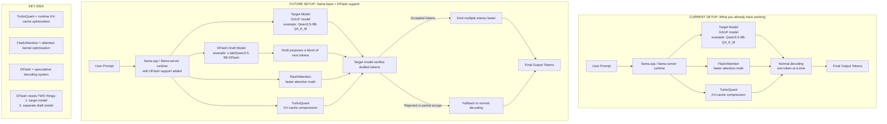

# DFlash Potential: Current vs Future Setup

```mermaid
flowchart TD

    %% =========================
    %% CURRENT SETUP
    %% =========================
    subgraph A["CURRENT SETUP: What you already have working"]
        P1[User Prompt] --> R1[llama.cpp / llama-server runtime]

        R1 --> M1[Target Model\nGGUF model\nexample: Qwen3.5-9B-Q4_K_M]
        R1 --> FA1[FlashAttention\nfaster attention math]
        R1 --> TQ1[TurboQuant\nKV-cache compression]

        M1 --> D1[Normal decoding\none token at a time]
        FA1 --> D1
        TQ1 --> D1

        D1 --> O1[Final Output Tokens]
    end

    %% =========================
    %% FUTURE SETUP
    %% =========================
    subgraph B["FUTURE SETUP: Same base + DFlash support"]
        P2[User Prompt] --> R2[llama.cpp / llama-server runtime\nwith DFlash support added]

        R2 --> M2[Target Model\nGGUF model\nexample: Qwen3.5-9B-Q4_K_M]
        R2 --> FA2[FlashAttention\nfaster attention math]
        R2 --> TQ2[TurboQuant\nKV-cache compression]
        R2 --> DM[DFlash Draft Model\nexample: z-lab/Qwen3.5-9B-DFlash]

        DM --> G[Draft proposes a block of next tokens]
        M2 --> V[Target model verifies drafted tokens]
        G --> V

        FA2 --> V
        TQ2 --> V

        V -->|Accepted tokens| A1[Emit multiple tokens faster]
        V -->|Rejected or partial accept| A2[Fallback to normal decoding]

        A1 --> O2[Final Output Tokens]
        A2 --> O2
    end

    %% =========================
    %% KEY IDEA
    %% =========================
    subgraph C["KEY IDEA"]
        K1[TurboQuant = runtime KV-cache optimization]
        K2[FlashAttention = attention kernel optimization]
        K3[DFlash = speculative decoding system]
        K4[DFlash needs TWO things:\n1. target model\n2. separate draft model]
    end
```