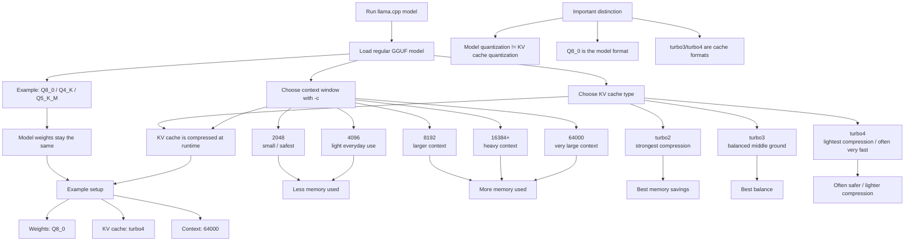

```mermaid
flowchart TD
    A[Run llama.cpp model] --> B[Load regular GGUF model]
    B --> B1[Example: Q8_0 / Q4_K / Q5_K_M]
    B --> C[Choose context window with -c]
    B --> D[Choose KV cache type]

    C --> C1[2048<br>small / safest]
    C --> C2[4096<br>light everyday use]
    C --> C3[8192<br>larger context]
    C --> C4[16384+<br>heavy context]
    C --> C5[64000<br>very large context]

    D --> D1[turbo2<br>strongest compression]
    D --> D2[turbo3<br>balanced middle ground]
    D --> D3[turbo4<br>lightest compression / often very fast]

    B1 --> E[Model weights stay the same]
    D --> F[KV cache is compressed at runtime]
    C --> F

    E --> G[Example setup]
    F --> G
    G --> G1[Weights: Q8_0]
    G --> G2[KV cache: turbo4]
    G --> G3[Context: 64000]

    C1 --> H[Less memory used]
    C2 --> H
    C3 --> I[More memory used]
    C4 --> I
    C5 --> I

    D1 --> J[Best memory savings]
    D2 --> K[Best balance]
    D3 --> L[Often safer / lighter compression]

    M[Important distinction] --> M1[Model quantization != KV cache quantization]
    M --> M2[Q8_0 is the model format]
    M --> M3[turbo3/turbo4 are cache formats]
```