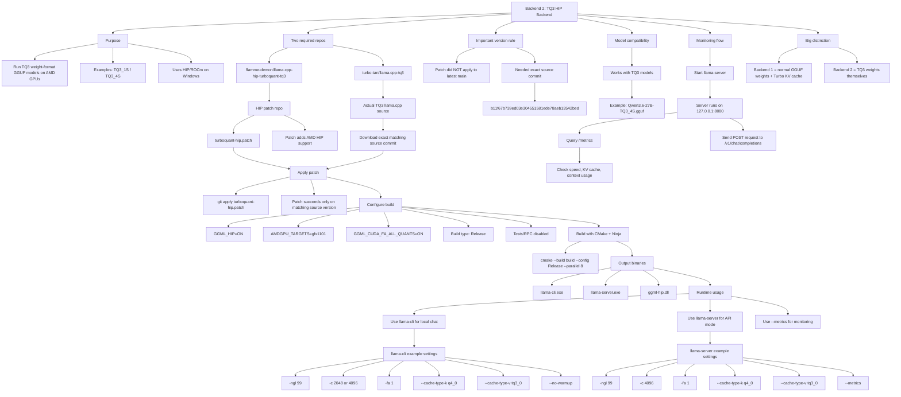

```mermaid
flowchart TD
    A[Backend 2: TQ3 HIP Backend] --> B[Purpose]
    B --> B1[Run TQ3 weight-format GGUF models on AMD GPUs]
    B --> B2[Examples: TQ3_1S / TQ3_4S]
    B --> B3[Uses HIP/ROCm on Windows]

    A --> C[Two required repos]
    C --> C1[turbo-tan/llama.cpp-tq3]
    C --> C2[flamme-demon/llama.cpp-hip-turboquant-tq3]

    C1 --> D[Actual TQ3 llama.cpp source]
    C2 --> E[HIP patch repo]

    E --> E1[turboquant-hip.patch]
    E --> E2[Patch adds AMD HIP support]

    A --> F[Important version rule]
    F --> F1[Patch did NOT apply to latest main]
    F --> F2[Needed exact source commit]
    F2 --> F3[b11f67b739ed03e304551581ede78aeb13542bed]

    D --> G[Download exact matching source commit]
    E1 --> H[Apply patch]
    G --> H
    H --> H1[git apply turboquant-hip.patch]
    H --> H2[Patch succeeds only on matching source version]

    H --> I[Configure build]
    I --> I1[GGML_HIP=ON]
    I --> I2[AMDGPU_TARGETS=gfx1101]
    I --> I3[GGML_CUDA_FA_ALL_QUANTS=ON]
    I --> I4[Build type: Release]
    I --> I5[Tests/RPC disabled]

    I --> J[Build with CMake + Ninja]
    J --> J1[cmake --build build --config Release --parallel 8]

    J --> K[Output binaries]
    K --> K1[llama-cli.exe]
    K --> K2[llama-server.exe]
    K --> K3[ggml-hip.dll]

    K --> L[Runtime usage]
    L --> L1[Use llama-cli for local chat]
    L --> L2[Use llama-server for API mode]
    L --> L3[Use --metrics for monitoring]

    L1 --> M[llama-cli example settings]
    M --> M1[-ngl 99]
    M --> M2[-c 2048 or 4096]
    M --> M3[-fa 1]
    M --> M4[--cache-type-k q4_0]
    M --> M5[--cache-type-v tq3_0]
    M --> M6[--no-warmup]

    L2 --> N[llama-server example settings]
    N --> N1[-ngl 99]
    N --> N2[-c 4096]
    N --> N3[-fa 1]
    N --> N4[--cache-type-k q4_0]
    N --> N5[--cache-type-v tq3_0]
    N --> N6[--metrics]

    A --> O[Model compatibility]
    O --> O1[Works with TQ3 models]
    O1 --> O2[Example: Qwen3.6-27B-TQ3_4S.gguf]

    A --> P[Monitoring flow]
    P --> P1[Start llama-server]
    P1 --> P2[Server runs on 127.0.0.1:8080]
    P2 --> P3[Query /metrics]
    P3 --> P4[Check speed, KV cache, context usage]
    P2 --> P5[Send POST request to /v1/chat/completions]

    A --> Q[Big distinction]
    Q --> Q1[Backend 1 = normal GGUF weights + Turbo KV cache]
    Q --> Q2[Backend 2 = TQ3 weights themselves]
```