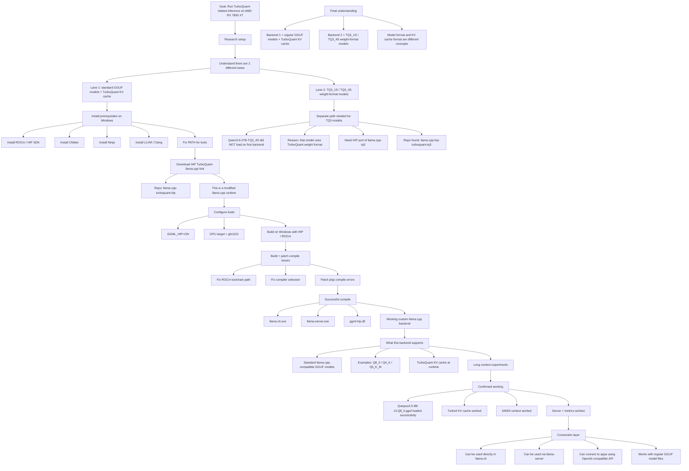

```mermaid
flowchart TD
    A[Goal: Run TurboQuant-related inference on AMD RX 7800 XT] --> B[Research setup]
    B --> C[Understand there are 2 different lanes]

    C --> C1[Lane 1: standard GGUF models + TurboQuant KV cache]
    C --> C2[Lane 2: TQ3_1S / TQ3_4S weight-format models]

    C1 --> D[Install prerequisites on Windows]
    D --> D1[Install ROCm / HIP SDK]
    D --> D2[Install CMake]
    D --> D3[Install Ninja]
    D --> D4[Install LLVM / Clang]
    D --> D5[Fix PATH for tools]

    D5 --> E[Download HIP TurboQuant llama.cpp fork]
    E --> E1[Repo: llama.cpp-turboquant-hip]
    E --> E2[This is a modified llama.cpp runtime]

    E2 --> F[Configure build]
    F --> F1[GGML_HIP=ON]
    F --> F2[GPU target = gfx1101]
    F --> F3[Build on Windows with HIP / ROCm]

    F3 --> G[Build + patch compile issues]
    G --> G1[Fix ROCm toolchain path]
    G --> G2[Fix compiler selection]
    G --> G3[Patch jinja compile errors]

    G3 --> H[Successful compile]
    H --> H1[llama-cli.exe]
    H --> H2[llama-server.exe]
    H --> H3[ggml-hip.dll]
    H --> H4[Working custom llama.cpp backend]

    H4 --> I[What this backend supports]
    I --> I1[Standard llama.cpp-compatible GGUF models]
    I --> I2[Examples: Q8_0 / Q4_K / Q5_K_M]
    I --> I3[TurboQuant KV cache at runtime]
    I --> I4[Long context experiments]

    I4 --> J[Confirmed working]
    J --> J1[Qwopus3.5-9B-v3.Q8_0.gguf loaded successfully]
    J --> J2[Turbo4 KV cache worked]
    J --> J3[64000 context worked]
    J --> J4[Server + metrics worked]

    J4 --> K[Connection layer]
    K --> K1[Can be used directly in llama-cli]
    K --> K2[Can be used via llama-server]
    K --> K3[Can connect to apps using OpenAI-compatible API]
    K --> K4[Works with regular GGUF model files]

    C2 --> L[Separate path needed for TQ3 models]
    L --> L1[Qwen3.6-27B-TQ3_4S did NOT load on first backend]
    L --> L2[Reason: that model uses TurboQuant weight format]
    L --> L3[Need HIP port of llama.cpp-tq3]
    L --> L4[Repo found: llama.cpp-hip-turboquant-tq3]

    M[Final understanding] --> M1[Backend 1 = regular GGUF models + TurboQuant KV cache]
    M --> M2[Backend 2 = TQ3_1S / TQ3_4S weight-format models]
    M --> M3[Model format and KV cache format are different concepts]
```